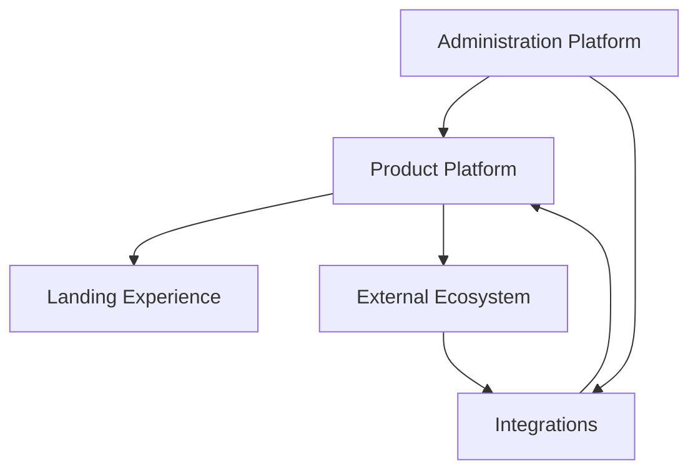
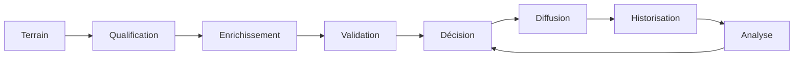
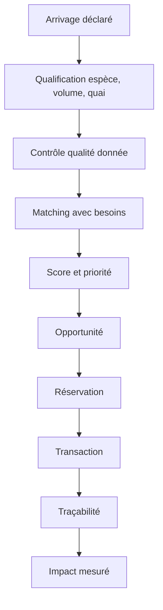
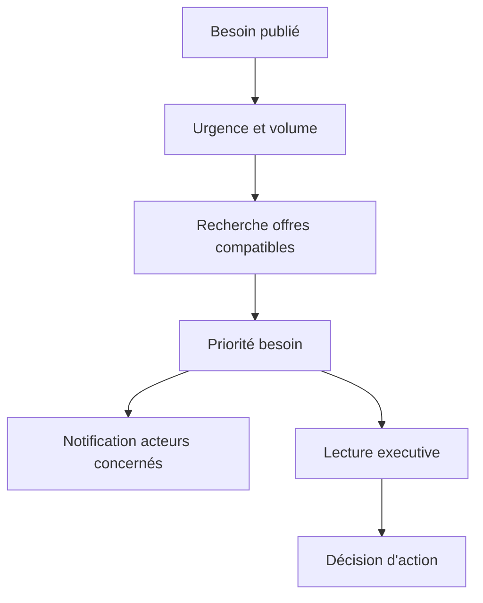
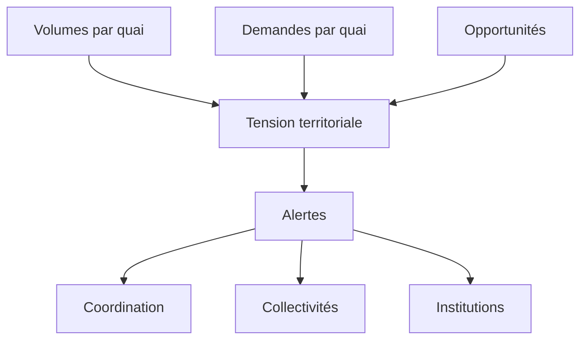
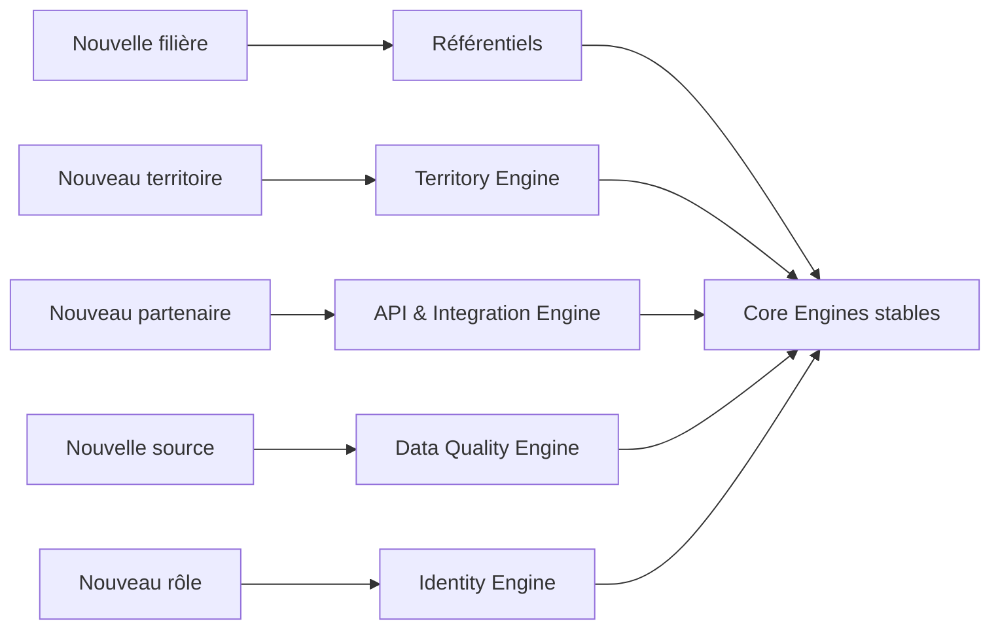
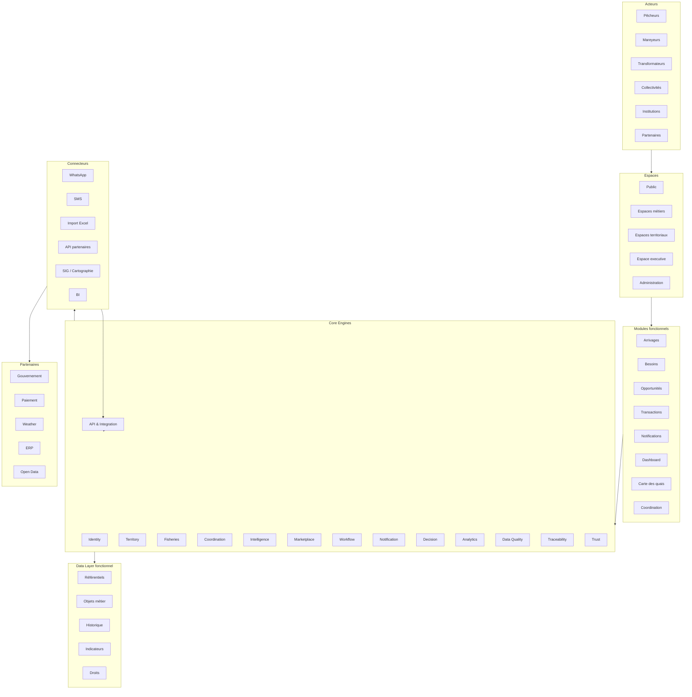

# Mbàmbulaan Functional Architecture v1.0

## Statut du document

Ce document décrit l'architecture fonctionnelle de Mbàmbulaan. Il explique comment l'écosystème fonctionne indépendamment de toute technologie, interface ou implémentation.

Il complète le Product Blueprint v1.0. Il ne décrit pas le business model, les personas, les parcours UX, les wireframes, le design system ou la roadmap.

## 1. Vue d'ensemble

Mbàmbulaan est un écosystème numérique de coordination. Il transforme des signaux dispersés de terrain en informations qualifiées, en opportunités, en décisions et en indicateurs d'impact.

L'architecture fonctionnelle repose sur cinq ensembles.

| Ensemble | Rôle | Finalité |
| --- | --- | --- |
| Landing Experience | Présenter la promesse, la crédibilité et l'accès au produit | Orienter les publics vers la démo, les espaces ou les modules |
| Product Platform | Orchestrer les arrivages, besoins, opportunités, transactions, alertes et décisions | Créer de la coordination opérationnelle |
| Administration Platform | Gérer les référentiels, validations, rôles, règles et qualité des données | Assurer la confiance et la gouvernance |
| Integrations | Recevoir et diffuser des données via des canaux externes | Connecter Mbàmbulaan à l'écosystème existant |
| External Ecosystem | Regrouper acteurs terrain, institutions, partenaires, systèmes tiers et sources de données | Étendre la valeur au-delà de la plateforme |

## 2. Les Core Engines

Les Core Engines sont les responsabilités fonctionnelles profondes de la plateforme. Ils ne représentent pas des écrans. Ils représentent les capacités de calcul, d'orchestration, de contrôle ou de décision.

| Moteur | Mission | Entrées | Sorties | Consommateurs | Valeur métier | Contraintes |
| --- | --- | --- | --- | --- | --- | --- |
| Identity Engine | Identifier les acteurs, rôles, organisations et droits | Acteurs, profils, organisations, zones | Identités, rôles, permissions | Espaces, gouvernance, notifications | Sécurise l'accès et personnalise les actions | Ne doit pas exposer toutes les données à tous |
| Territory Engine | Structurer quais, zones, régions et tensions territoriales | Quais, coordonnées, volumes, besoins | Activité, tension, priorités territoriales | Carte, dashboard, collectivités | Rend le territoire lisible | Les zones doivent rester administrables |
| Fisheries Engine | Qualifier les objets halieutiques | Espèces, lots, volumes, statuts, saisonnalité | Lots qualifiés, catégories, disponibilité | Arrivages, qualité, impact | Donne un langage métier commun | Référentiel partagé obligatoire |
| Coordination Engine | Relier offres, besoins, acteurs et actions | Arrivages, besoins, disponibilités | Opportunités, relations, actions proposées | Opportunités, coordination, notifications | Transforme l'information en coordination | Les règles doivent rester explicables |
| Intelligence Engine | Calculer recommandations, scores, priorités et alertes | Matching, tension, qualité, confiance, impact | Scores, priorités, recommandations | Coordination, dashboard, espaces | Aide à décider au bon moment | Ne doit pas devenir opaque |
| Marketplace Engine | Gérer les mises en relation économiques | Lots, besoins, réservations, engagements | Réservations, offres activées, statuts | Opportunités, transactions | Permet la mise en relation opérationnelle | Ne remplace pas les accords terrain |
| Workflow Engine | Suivre les étapes de traitement | Statuts, événements, transitions | Transactions, avancement, historique | Transactions, traçabilité, notifications | Rend le processus pilotable | Les transitions doivent être contrôlées |
| Notification Engine | Diffuser les signaux utiles au bon acteur | Événements, alertes, priorités, rôles | Notifications, messages, relances | Tous les espaces | Réduit la perte d'information | Éviter le bruit et la surcharge |
| Decision Engine | Consolider les décisions possibles | KPI, alertes, priorités, risques | Décisions recommandées, arbitrages | Institutions, coordination, executive | Rend la décision explicite | Toujours afficher les raisons |
| Analytics Engine | Mesurer activité, impact et performance | Volumes, transactions, besoins, opportunités | KPI, tendances, synthèses | Dashboard, executive, financeurs | Prouve la valeur créée | Distinguer estimé et vérifié |
| Data Quality Engine | Contrôler la qualité et cohérence des données | Données brutes, doublons, statuts | Alertes qualité, validations, anomalies | Administration, référents | Renforce la fiabilité | Ne bloque pas inutilement le terrain |
| API & Integration Engine | Organiser les échanges avec systèmes externes | Messages, imports, API, fichiers | Données normalisées, exports | Partenaires, administration | Prépare l'ouverture de la plateforme | Les intégrations restent découplées |
| Traceability Engine | Historiser les événements d'un lot ou d'une décision | Lots, opportunités, transactions, notifications | Ligne de vie, preuves, statuts | Transactions, institutions, confiance | Crée une mémoire vérifiable | L'historique ne doit pas être réécrit |
| Trust Engine | Évaluer la fiabilité des acteurs et engagements | Historique, annulations, complétude, délais | Score de confiance, signaux de vigilance | Opportunités, coordination, espaces | Oriente vers des relations plus fiables | Éviter les décisions discriminantes |

## 3. Les modules fonctionnels

Les modules sont des capacités métier consommées par différents espaces. Ils ne correspondent pas obligatoirement à une page.

| Module | Objectif | Fonctions | Moteurs utilisés | Dépendances | Évolutivité |
| --- | --- | --- | --- | --- | --- |
| Arrivages | Rendre visibles les lots débarqués | Déclarer, qualifier, rechercher, suivre un lot | Fisheries, Territory, Data Quality, Traceability | Référentiel espèces, quais, acteurs | Peut couvrir d'autres produits ou filières |
| Besoins | Structurer la demande | Publier, filtrer, prioriser, couvrir un besoin | Fisheries, Coordination, Intelligence | Espèces, volumes, urgences, acteurs | Peut intégrer prévisions et contrats |
| Opportunités | Détecter les correspondances utiles | Matcher, scorer, expliquer, proposer une mise en relation | Coordination, Intelligence, Marketplace, Trust | Arrivages, besoins, acteurs | Peut évoluer vers négociation ou enchères contrôlées |
| Transactions | Suivre une réservation jusqu'à finalisation | Réserver, avancer le statut, clôturer, annuler | Marketplace, Workflow, Traceability | Opportunités, acteurs, statuts | Peut intégrer paiement, livraison, qualité |
| Notifications | Alerter les acteurs au bon moment | Générer, cibler, filtrer, marquer comme traité | Notification, Intelligence, Identity | Événements, rôles, alertes | Peut intégrer SMS, WhatsApp, email |
| Dashboard | Mesurer la valeur opérationnelle | KPI, activité, impact, tension, priorités | Analytics, Decision, Territory, Impact via Intelligence | Données consolidées | Peut devenir BI multi-territoires |
| Carte des quais | Lire le territoire | Visualiser activité, tension, impact, détails quai | Territory, Analytics, Decision | Quais, volumes, besoins, opportunités | Peut intégrer SIG et couches externes |
| Coordination | Piloter les actions du jour | Voir priorités, alertes, simulations, décisions | Coordination, Intelligence, Workflow, Notification | Tous les signaux opérationnels | Peut devenir cockpit multi-acteurs |
| Espaces métiers | Adapter la plateforme à chaque rôle | Présenter actions, données et recommandations par rôle | Identity, Decision, Notification, Analytics | Rôles, permissions, données filtrées | Peut accueillir de nouveaux rôles |
| Démo | Expliquer le système en action | Scénario, chronologie, impact, preuves | Decision, Analytics, Traceability | Données de démonstration | Peut devenir outil commercial ou formation |
| Executive | Donner une lecture institutionnelle | Synthèse, risques, décisions, impact | Decision, Analytics, Territory, Trust | KPI, alertes, tensions | Peut servir aux partenaires publics et financiers |
| Administration fonctionnelle | Maintenir référentiels et règles | Valider, corriger, administrer, auditer | Identity, Data Quality, API, Territory | Référentiels, droits, historiques | Devient indispensable en production |

## 4. Les espaces applicatifs

Chaque espace présente une partie du système selon les responsabilités de l'acteur. Le principe fondamental est la visibilité utile : chaque acteur voit ce qui lui permet d'agir, pas l'ensemble brut de la plateforme.

| Espace | Objectifs | Données visibles | Actions possibles | Décisions possibles |
| --- | --- | --- | --- | --- |
| Public | Comprendre la promesse et accéder au produit | Vision, démo, preuves, modules ouverts | Lancer la démo, demander accès, choisir un espace | Comprendre si Mbàmbulaan répond au besoin |
| Administration Mbàmbulaan | Gouverner le système | Référentiels, droits, anomalies, historiques | Valider, corriger, paramétrer, auditer | Arbitrer règles, qualité, accès |
| Référents terrain | Qualifier les informations locales | Arrivages, besoins, quais, statuts locaux | Saisir, confirmer, signaler une anomalie | Valider un signal terrain |
| Institutions | Lire les risques et impacts consolidés | KPI, tensions, alertes, traçabilité, synthèses | Consulter, exporter, demander clarification | Prioriser politiques ou interventions |
| Collectivités | Piloter un territoire | Quais, tensions, besoins, opportunités, impact local | Surveiller, prioriser, alerter | Décider où agir localement |
| ONG | Identifier impact et vulnérabilités | Risques, pertes évitées, acteurs impactés, zones sensibles | Suivre, orienter appui, documenter impact | Choisir zones ou actions d'appui |
| Investisseurs | Évaluer robustesse et potentiel | Impact, activité, adoption, risques, couverture | Lire synthèse, comparer territoires | Décider soutien, financement, expérimentation |
| Entreprises | Sécuriser approvisionnement | Lots disponibles, besoins, opportunités, transactions | Réserver, suivre, demander volumes | Décider achat ou logistique |
| Coopératives | Coordonner les membres | Arrivages membres, besoins, opportunités, alertes | Mutualiser, déclarer, orienter | Décider répartition ou action collective |
| Acheteurs | Trouver et réserver des lots | Lots, opportunités, qualité, confiance, transactions | Publier besoin, réserver, suivre | Choisir lot, quai, vendeur |
| Exportateurs | Planifier volumes et conformité | Lots qualifiés, disponibilité, traçabilité, statuts | Exprimer besoin, suivre lot, préparer dossier | Décider approvisionnement export |
| Centres de recherche | Observer les dynamiques | Données agrégées, tendances, tensions, impact | Analyser, produire lecture, demander jeu de données | Formuler hypothèses ou recommandations |
| Financeurs | Suivre les effets d'un programme | KPI, territoires, risques, bénéficiaires, impact | Consulter, comparer, auditer | Décider poursuite ou ciblage financement |

## 5. Les flux de données

### Cycle général de transformation

### Flux lot vers opportunité

### Flux besoin vers décision

### Flux territoire vers alerte

## 6. Les sources de données

| Source | Nature | Usage | Niveau de maturité |
| --- | --- | --- | --- |
| WhatsApp | Signal terrain non structuré | Déclarations, besoins, alertes informelles | Canal probable à structurer |
| Réseau de référents | Données validées localement | Qualification, confirmation, anomalies | Source clé de confiance |
| Back-office | Données administrées | Référentiels, corrections, droits | Indispensable en production |
| API partenaires | Données système à système | Institutions, météo, paiement, SIG | À préparer |
| Import Excel | Données semi-structurées | Lots historiques, référentiels, reporting | Utile pour démarrage |
| Formulaires | Données structurées | Arrivages, besoins, inscriptions | Base opérationnelle |
| Open Data | Données publiques | Contexte territorial, météo, zones | Enrichissement |
| IoT | Capteurs terrain | Température, conservation, géolocalisation | Vision future |
| GPS | Positionnement | Quais, trajets, logistique | Vision future |
| Images satellite | Observation territoriale | Activité, météo, risques côtiers | Vision future |

## 7. Les intégrations

Les intégrations doivent être préparées sans rendre le coeur du produit dépendant d'un partenaire unique.

| Intégration future | Finalité | Principe d'architecture |
| --- | --- | --- |
| API gouvernement | Reporting, conformité, politiques publiques | Export contrôlé et agrégé |
| Paiement | Sécurisation économique | Couplage tardif avec transaction |
| SMS | Notification terrain | Canal de diffusion interchangeable |
| WhatsApp Business | Collecte et notification | Adaptateur connecté au Notification Engine |
| SIG | Analyse territoriale | Couche consommant le Territory Engine |
| Cartographie | Visualisation zones et quais | Remplaçable sans changer les règles métier |
| OpenStreetMap | Base cartographique | Source externe non critique |
| Weather | Risques et saisonnalité | Enrichissement du Decision Engine |
| ERP | Entreprises et coopératives | Synchronisation par API & Integration Engine |
| BI | Analyse avancée | Lecture depuis Analytics Engine |

## 8. Gouvernance des données

La gouvernance définit qui crée, valide, consulte, modifie et décide. Elle doit protéger la confiance sans bloquer l'usage terrain.

| Objet de donnée | Création | Validation | Consultation | Modification | Décision |
| --- | --- | --- | --- | --- | --- |
| Acteur | Acteur, admin | Administration Mbàmbulaan | Selon droits | Acteur, admin | Administration |
| Arrivage | Pêcheur, référent | Référent, Data Quality | Acteurs autorisés | Créateur, référent, admin | Coordination |
| Besoin | Acheteur, coopérative, entreprise | Data Quality, référent si nécessaire | Acteurs autorisés | Créateur, admin | Marketplace |
| Opportunité | Coordination Engine | Intelligence, règles métier | Parties concernées | Système, admin | Acteurs concernés |
| Réservation | Acheteur ou acteur autorisé | Marketplace Engine | Parties concernées | Workflow contrôlé | Acheteur et vendeur |
| Transaction | Workflow Engine | Parties concernées | Parties, institutions agrégées | Workflow contrôlé | Parties concernées |
| Notification | Notification Engine | Règles métier | Destinataire | Système, destinataire | Destinataire |
| KPI | Analytics Engine | Administration, règles | Selon espace | Système | Institution, collectivité |
| Référentiel | Administration | Administration | Tous selon besoin | Administration | Gouvernance |

### Matrice RACI

| Processus | Responsable | Accountable | Consulté | Informé |
| --- | --- | --- | --- | --- |
| Déclaration d'arrivage | Pêcheur ou référent | Acteur déclarant | Quai, coopérative | Acheteurs concernés |
| Validation d'un signal terrain | Référent terrain | Administration Mbàmbulaan | Acteur source | Espaces concernés |
| Matching offre-besoin | Coordination Engine | Mbàmbulaan | Acteurs concernés | Acheteurs, vendeurs |
| Réservation | Acheteur | Acheteur | Vendeur, référent | Coordination, notifications |
| Suivi transaction | Parties concernées | Marketplace / Workflow | Référent si besoin | Institution en agrégé |
| Pilotage territorial | Collectivité | Collectivité | Référents, institutions | Acteurs locaux |
| Synthèse institutionnelle | Decision Engine | Institution consultante | Mbàmbulaan, collectivités | Partenaires autorisés |

## 9. Gestion des droits

Chaque acteur possède son propre espace. Personne ne voit tout par défaut. Mbàmbulaan orchestre les données, filtre les vues et expose seulement les informations utiles à l'action.

| Niveau d'accès | Description | Exemples |
| --- | --- | --- |
| Public | Données non sensibles et démonstration | Vision, preuve produit, démo |
| Personnel | Données de l'acteur | Ses lots, besoins, transactions, notifications |
| Relationnel | Données partagées entre parties concernées | Opportunité, réservation, transaction commune |
| Organisationnel | Données d'une coopérative ou entreprise | Activité membres, besoins groupés |
| Territorial | Données agrégées d'une zone | Quais, tensions, impact local |
| Institutionnel | Données consolidées et risques | KPI, alertes, synthèses |
| Administration | Données de gouvernance et contrôle | Référentiels, droits, anomalies |

Règles fondamentales :

1. L'accès suit le rôle, l'organisation, le territoire et la relation métier.
2. Les données individuelles ne deviennent visibles que lorsqu'une relation métier le justifie.
3. Les vues institutionnelles privilégient l'agrégé, sauf mandat explicite.
4. Les décisions sensibles doivent conserver une trace.
5. Les droits doivent être configurables sans modifier les moteurs métier.

## 10. Principes d'architecture

| Principe | Implication |
| --- | --- |
| Le moteur n'a pas connaissance de l'interface | Les règles fonctionnelles restent réutilisables |
| Les interfaces consomment les moteurs | Les espaces affichent, filtrent et déclenchent des actions |
| La donnée n'est jamais dupliquée | Les modules partagent les objets métier de référence |
| Chaque donnée possède un propriétaire | La gouvernance reste claire |
| Chaque décision est traçable | La confiance et l'audit sont possibles |
| Les modules sont découplés | Un module peut évoluer sans casser l'ensemble |
| Les intégrations sont des adaptateurs | Aucun partenaire ne doit devenir le coeur du système |
| Les recommandations sont explicables | L'utilisateur comprend pourquoi agir |
| La qualité des données est progressive | Le terrain peut contribuer même avec des données imparfaites |
| Les droits sont contextuels | Rôle, territoire, organisation et relation métier comptent |
| Les indicateurs distinguent estimé et vérifié | L'impact reste crédible |
| L'architecture est multi-filière par conception | Les objets génériques permettent l'extension |

## 11. Extensibilité

L'architecture doit permettre d'ajouter de nouveaux contextes sans reconstruire la plateforme.

| Extension | Ce qui change | Ce qui reste stable |
| --- | --- | --- |
| Nouvelle filière | Référentiels produits, statuts, règles de qualité | Engines, droits, flux, gouvernance |
| Nouveau territoire | Quais ou zones, acteurs locaux, règles d'accès | Territory Engine, Analytics, Decision |
| Nouveau partenaire | Connecteur, format d'échange, droits | API & Integration Engine |
| Nouvelle source de données | Adaptateur de collecte, règles de validation | Data Quality, référentiels, historisation |
| Nouveau rôle | Espace, permissions, recommandations | Identity Engine, gouvernance |
| Nouveau canal de notification | Adaptateur de diffusion | Notification Engine |

## 12. Architecture cible

## Architecture Risks & Open Questions

### Dépendances circulaires à surveiller

| Risque | Description | Mesure |
| --- | --- | --- |
| Intelligence et Decision | Le Decision Engine pourrait recalculer ce que l'Intelligence Engine produit déjà | Le Decision Engine doit composer et arbitrer, pas recalculer les scores |
| Analytics et Impact | Les indicateurs peuvent être comptés deux fois | Définir un dictionnaire unique des KPI |
| Notification et Workflow | Une notification peut déclencher une action qui change le workflow, puis renotifier | Introduire des règles anti-boucle et statuts d'événement |
| Territory et Coordination | La tension territoriale influence le matching, qui influence la tension | Horodater les calculs et distinguer signal courant et effet projeté |

### Moteurs potentiellement redondants

| Moteur | Risque de redondance | Arbitrage proposé |
| --- | --- | --- |
| Intelligence Engine | Peut absorber recommandation, priorisation, alertes et qualité | Le garder comme moteur de synthèse, avec sous-domaines spécialisés |
| Decision Engine | Peut ressembler au Dashboard | Le limiter aux décisions et arbitrages, pas à l'affichage KPI |
| Marketplace Engine | Peut se confondre avec Coordination Engine | Coordination détecte, Marketplace engage |
| Data Quality Engine | Peut être confondu avec administration | Le moteur contrôle ; l'administration décide et corrige |

### Modules à justifier en continu

| Module | Point de vigilance |
| --- | --- |
| Démo | Doit démontrer le système, pas devenir une page marketing autonome |
| Executive | Doit rester une lecture institutionnelle synthétique, pas un deuxième dashboard complet |
| Coordination | Doit rester le cockpit opérationnel, pas une répétition de tous les modules |
| Espaces métiers | Doivent guider par rôle, pas dupliquer toutes les pages |

### Points à arbitrer

- Quel niveau de validation humaine est nécessaire avant qu'une donnée terrain alimente une décision institutionnelle ?
- Quels rôles peuvent voir des données nominatives et dans quelles conditions ?
- Quels indicateurs sont officiels, estimés ou exploratoires ?
- Où placer la limite entre recommandation automatique et décision humaine ?
- Comment éviter que les notifications critiques deviennent trop nombreuses ?
- Quelle granularité territoriale doit être supportée au lancement : quai, commune, département ou région ?
- Quels objets doivent être génériques dès maintenant pour préparer d'autres filières ?
