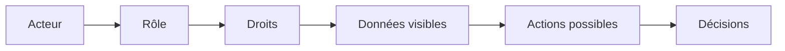
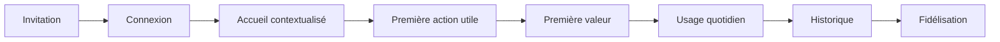
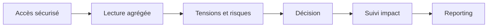
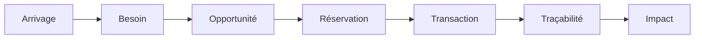
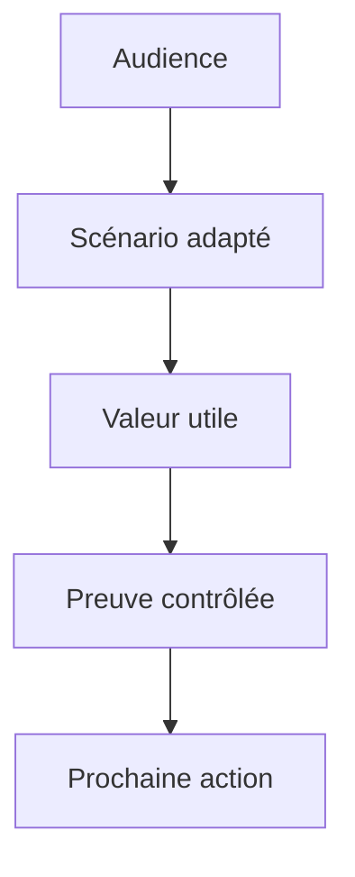

# Mbàmbulaan Actor Journeys v1.0

## Statut du document

Ce document décrit les parcours acteurs de Mbàmbulaan. Il devient la référence UX produit : toute future interface devra être justifiée par un parcours décrit ici.

Il s'appuie sur le Product Blueprint v1.0, la Functional Architecture v1.0 et le Business Model v1.0. Il ne décrit aucune interface React, aucun composant, aucun wireframe et aucune implémentation.

## Introduction

Mbàmbulaan ne montre jamais tout le produit à tout le monde.

Chaque utilisateur découvre uniquement les fonctionnalités utiles à son rôle, les données autorisées, les décisions qui le concernent et les actions qu'il peut réaliser. Mbàmbulaan est une plateforme contextualisée : elle orchestre une filière complète, mais chaque acteur dispose d'une lecture filtrée par rôle, territoire, organisation, relation métier et niveau de responsabilité.

## Principes de contextualisation

| Principe | Conséquence UX |
| --- | --- |
| Personne ne voit tout | Chaque espace masque les données sans utilité ou sans droit |
| Le rôle guide l'interface | Les actions principales changent selon l'acteur |
| La décision prime | Chaque vue doit rapprocher d'une décision ou d'une action |
| La confiance est visible | Les statuts, droits, sources et historiques doivent être explicites |
| La donnée sensible reste protégée | Les vues institutionnelles privilégient l'agrégé et le mandat |

## Personas et parcours complets

### 1. Visiteur

| Dimension | Description |
| --- | --- |
| Mission | Comprendre la vision, la crédibilité et la valeur de Mbàmbulaan sans accéder aux données réelles |
| Objectifs | Découvrir, voir des démonstrations publiques, comprendre les cas d'usage, demander une démo |
| Frustrations actuelles | Information sectorielle dispersée, difficulté à distinguer vitrine et produit opérationnel |
| Ce qu'il voit | Landing, vision, cas d'usage, quelques chiffres agrégés, cartes illustratives, vidéos, témoignages, formulaire |
| Ce qu'il ne voit pas | Données réelles, identités opérationnelles, transactions, alertes internes, API, administration |
| Son tableau de bord | Aucun tableau de bord produit ; seulement une expérience publique de découverte |
| Décisions | Demander une démo, contacter l'équipe, suivre le projet |
| Notifications | Confirmation de demande, invitation éventuelle |
| Données produites | Coordonnées, organisation, intention, message |
| Données consommées | Vision, preuves publiques, chiffres agrégés |
| Moteurs sollicités | Identity léger, Analytics public, Decision éditorial |
| Modules utilisés | Landing, Démo publique, formulaire |
| Interactions | Équipe Mbàmbulaan |
| Droits | Lecture publique uniquement ; aucune création métier ; aucun export ; aucune API |
| Parcours | Découverte -> vision -> démo publique -> cas d'usage -> demande de rendez-vous -> qualification -> invitation éventuelle |

### 2. Pêcheur référent

| Dimension | Description |
| --- | --- |
| Mission | Rendre les arrivages visibles, fiables et exploitables |
| Objectifs | Déclarer les lots, confirmer les volumes, suivre opportunités et transactions |
| Frustrations actuelles | Lots peu visibles, dépendance aux relations directes, risque de perte |
| Ce qu'il voit | Ses lots, son quai, opportunités concernées, réservations, notifications, historique |
| Ce qu'il ne voit pas | Données privées d'autres pêcheurs, marges acheteurs, décisions institutionnelles détaillées, administration |
| Son tableau de bord | Lots déclarés, lots réservés, transactions en cours, alertes qualité |
| Décisions | Déclarer, confirmer, répondre à une opportunité, suivre une transaction |
| Notifications | Opportunité détectée, lot réservé, transaction avancée, alerte qualité |
| Données produites | Arrivage, espèce, quai, quantité, heure, statut, confirmation terrain |
| Données consommées | Besoins compatibles, opportunités, qualité, historique lot |
| Moteurs sollicités | Fisheries, Coordination, Intelligence, Quality, Traceability, Notification, Trust |
| Modules utilisés | Arrivages, Opportunités, Transactions, Notifications, Espaces |
| Interactions | Mareyeurs, transformateurs, coopératives, animateur territorial |
| Droits | Lecture personnelle ; création d'arrivage ; validation limitée ; export limité ; pas d'API |
| Parcours | Invitation -> accueil pêcheur -> déclaration lot -> qualification -> opportunité -> réservation -> transaction -> historique |

### 3. Mareyeur référent

| Dimension | Description |
| --- | --- |
| Mission | Structurer la demande et sécuriser les mises en relation |
| Objectifs | Consulter lots, publier besoins, recevoir opportunités, réserver, suivre transactions |
| Frustrations actuelles | Recherche manuelle, information tardive, concurrence, incertitude volumes |
| Ce qu'il voit | Arrivages disponibles, besoins, opportunités recommandées, confiance acteur, transactions |
| Ce qu'il ne voit pas | Données concurrentes sensibles, données nominatives non liées, administration globale |
| Son tableau de bord | Besoins ouverts, opportunités prioritaires, réservations, transactions |
| Décisions | Publier un besoin, réserver, prioriser un quai, finaliser transaction |
| Notifications | Nouveau lot compatible, besoin couvert, opportunité prioritaire |
| Données produites | Besoins, réservations, confirmations, statuts transactionnels |
| Données consommées | Arrivages, qualité, tensions, confiance vendeur, recommandations |
| Moteurs sollicités | Coordination, Intelligence, Marketplace, Workflow, Notification, Trust |
| Modules utilisés | Besoins, Arrivages, Opportunités, Transactions, Notifications |
| Interactions | Pêcheurs, transformateurs, coopératives, animateurs |
| Droits | Lecture lots accessibles ; création besoins ; réservation ; export limité ; API selon offre |
| Parcours | Connexion -> consultation arrivages -> publication besoin -> opportunités -> réservation -> suivi transaction |

### 4. Animateur territorial

| Dimension | Description |
| --- | --- |
| Mission | Accompagner l'adoption locale et qualifier les signaux terrain |
| Objectifs | Suivre quais, aider acteurs, valider signaux, remonter blocages |
| Frustrations actuelles | Données dispersées, validations manuelles, blocages invisibles |
| Ce qu'il voit | Carte territoriale, alertes locales, arrivages à confirmer, besoins, activité acteurs |
| Ce qu'il ne voit pas | Données hors territoire, informations financières privées, API sensibles |
| Son tableau de bord | Quais actifs, alertes à traiter, validations en attente, tensions |
| Décisions | Prioriser visite, confirmer signal, relancer acteur, escalader tension |
| Notifications | Donnée à valider, quai sous tension, acteur bloqué, alerte qualité |
| Données produites | Validations, corrections, commentaires terrain, signalements |
| Données consommées | Activité territoriale, arrivages, besoins, tensions, recommandations |
| Moteurs sollicités | Territory, Data Quality, Alerts, Prioritization, Notification, Analytics |
| Modules utilisés | Coordination, Quais, Arrivages, Besoins, Notifications, Dashboard |
| Interactions | Pêcheurs, mareyeurs, collectivités, administration Mbàmbulaan |
| Droits | Lecture territoriale ; validation locale ; création signalement ; export encadré |
| Parcours | Connexion -> vue territoire -> alertes -> validation terrain -> accompagnement -> escalade -> suivi |

### 5. Coopérative

| Dimension | Description |
| --- | --- |
| Mission | Coordonner les membres et mutualiser l'action économique |
| Objectifs | Voir activité membres, structurer volumes, suivre opportunités collectives |
| Frustrations actuelles | Coordination manuelle, faible preuve d'activité, données dispersées |
| Ce qu'il voit | Arrivages membres, besoins groupés, opportunités, transactions, KPI coopérative |
| Ce qu'il ne voit pas | Données d'autres coopératives, données privées hors mandat, administration système |
| Son tableau de bord | Volumes membres, besoins ouverts, transactions collectives, impact |
| Décisions | Mutualiser lot, orienter membre, prioriser vente, demander appui |
| Notifications | Opportunité collective, tension quai, transaction membre, alerte qualité |
| Données produites | Besoins groupés, validations internes, données organisationnelles |
| Données consommées | Arrivages membres, opportunités, tensions, impact |
| Moteurs sollicités | Identity, Coordination, Analytics, Trust, Territory, Notification |
| Modules utilisés | Espaces, Arrivages, Besoins, Opportunités, Transactions, Dashboard |
| Interactions | Membres, acheteurs, collectivités, ONG, financeurs |
| Droits | Lecture organisationnelle ; création besoins groupés ; validation interne ; export agrégé |
| Parcours | Invitation organisation -> configuration membres -> lecture agrégée -> action collective -> reporting |

### 6. Collectivité

| Dimension | Description |
| --- | --- |
| Mission | Piloter les enjeux locaux de la filière |
| Objectifs | Voir quais, tensions, besoins non couverts, impact et priorités |
| Frustrations actuelles | Données tardives, faible visibilité locale, difficulté à mesurer l'effet des actions |
| Ce qu'il voit | Carte des quais, dashboard territorial, alertes, tensions, impact, lecture institutionnelle |
| Ce qu'il ne voit pas | Données commerciales privées, détails hors territoire, données nominatives non nécessaires |
| Son tableau de bord | Activité quais, volumes, besoins non couverts, tensions, actions prioritaires |
| Décisions | Renforcer un quai, mobiliser un acteur, soutenir une zone, suivre une tension |
| Notifications | Tension critique, forte demande, lot sensible, opportunité prioritaire |
| Données produites | Décisions, demandes d'intervention, commentaires territoriaux |
| Données consommées | KPI, cartes, alertes, tendances, risques |
| Moteurs sollicités | Territory, Analytics, Decision, Alerts, Impact, Prioritization |
| Modules utilisés | Quais, Dashboard, Coordination, Executive, Notifications |
| Interactions | Animateurs, institutions, coopératives, ONG, administration Mbàmbulaan |
| Droits | Lecture territoriale ; validation politique limitée ; export institutionnel |
| Parcours | Carte -> tensions -> priorités -> décision locale -> suivi impact -> reporting |

### 7. Direction des Pêches

| Dimension | Description |
| --- | --- |
| Mission | Lire la filière consolidée et orienter les politiques sectorielles |
| Objectifs | Suivre volumes, tensions, besoins, zones critiques, impact et conformité |
| Frustrations actuelles | Remontées lentes, données hétérogènes, faible lecture temps réel |
| Ce qu'il voit | Vue nationale ou régionale, executive, observatoire, risques, cartes, KPI |
| Ce qu'il ne voit pas | Données commerciales détaillées sans mandat, informations privées non agrégées |
| Son tableau de bord | Volumes par zone, besoins couverts, alertes critiques, tendances |
| Décisions | Orienter appui, demander contrôle, prioriser zone, suivre programme |
| Notifications | Tension critique, baisse couverture, incident qualité, évolution impact |
| Données produites | Référentiels, demandes de suivi, annotations institutionnelles |
| Données consommées | Données agrégées, cartes, KPI, historiques, risques |
| Moteurs sollicités | Analytics, Decision, Territory, Data Quality, Impact, Alerts |
| Modules utilisés | Executive, Dashboard, Quais, Coordination, Notifications |
| Interactions | Ministère, collectivités, référents, ONG, partenaires |
| Droits | Lecture institutionnelle ; validation référentiel selon mandat ; export ; API possible |
| Parcours | Synthèse nationale -> analyse zones -> priorités -> demande d'action -> suivi programmes |

### 8. Ministère

| Dimension | Description |
| --- | --- |
| Mission | Arbitrer politiques, financements et programmes nationaux |
| Objectifs | Comprendre risques, impact, couverture territoriale et besoins d'investissement |
| Frustrations actuelles | Reporting retardé, données fragmentées, manque de preuve d'impact |
| Ce qu'il voit | Vue executive, tendances, risques, cartes agrégées, KPI nationaux, décisions recommandées |
| Ce qu'il ne voit pas | Détails opérationnels sans nécessité, messages privés, données nominatives hors mandat |
| Son tableau de bord | Impact national, tensions majeures, investissements prioritaires, couverture |
| Décisions | Financer, arbitrer, lancer programme, mobiliser partenaire, évaluer politique |
| Notifications | Alertes critiques nationales, seuils de risque, rapports périodiques |
| Données produites | Priorités publiques, demandes de rapport, décisions d'appui |
| Données consommées | Synthèses, KPI, données agrégées, observatoire |
| Moteurs sollicités | Decision, Analytics, Impact, Territory, Prioritization, Alerts |
| Modules utilisés | Executive, Dashboard, Quais, Notifications |
| Interactions | Direction des Pêches, collectivités, institutions, financeurs |
| Droits | Lecture stratégique ; export institutionnel ; API agrégée ; pas d'administration opérationnelle par défaut |
| Parcours | Executive -> risques -> comparaison territoires -> arbitrage -> programme -> impact |

### 9. Institution

| Dimension | Description |
| --- | --- |
| Mission | Financer, accompagner, réguler ou évaluer avec une donnée consolidée |
| Objectifs | Comprendre robustesse, impact, risques et besoins de soutien |
| Frustrations actuelles | Données non comparables, faible traçabilité, suivi d'impact coûteux |
| Ce qu'il voit | Executive, observatoire, KPI, tensions, risques, données agrégées |
| Ce qu'il ne voit pas | Données individuelles sans autorisation, administration interne, secrets commerciaux |
| Son tableau de bord | Impact, territoires suivis, risques, indicateurs programme, alertes |
| Décisions | Financer, prolonger, cibler, auditer, demander correction |
| Notifications | Rapports, alertes critiques, évolution KPI, risques programme |
| Données produites | Critères de programme, demandes d'analyse, décisions de financement |
| Données consommées | Données agrégées, observatoire, KPI, synthèses |
| Moteurs sollicités | Analytics, Decision, Impact, Trust, Data Quality, API & Integration |
| Modules utilisés | Executive, Dashboard, Quais, Notifications, Exports |
| Interactions | Ministère, ONG, collectivités, Mbàmbulaan |
| Droits | Lecture agrégée ; export ; API selon convention ; aucune administration opérationnelle |
| Parcours | Invitation -> accès institutionnel -> analyse portefeuille -> risques -> décision -> suivi indicateurs |

### 10. ONG

| Dimension | Description |
| --- | --- |
| Mission | Cibler les actions d'appui et mesurer l'impact terrain |
| Objectifs | Identifier zones sensibles, lots à risque, besoins non couverts, acteurs à accompagner |
| Frustrations actuelles | Difficulté à cibler, suivi d'impact coûteux, données terrain incomplètes |
| Ce qu'il voit | Tensions, impact, alertes, carte, acteurs agrégés, zones prioritaires |
| Ce qu'il ne voit pas | Transactions privées détaillées, données commerciales sensibles, administration |
| Son tableau de bord | Zones vulnérables, actions prioritaires, impact généré, alertes critiques |
| Décisions | Orienter appui, financer équipement, mobiliser terrain, documenter résultat |
| Notifications | Risque de perte, tension critique, besoin non couvert, opportunité d'appui |
| Données produites | Programmes, observations, appuis, retours terrain |
| Données consommées | Alertes, tensions, impact, référentiels |
| Moteurs sollicités | Impact, Tension, Prioritization, Alerts, Analytics, Territory |
| Modules utilisés | Dashboard, Quais, Coordination, Executive, Notifications |
| Interactions | Collectivités, référents, coopératives, institutions |
| Droits | Lecture agrégée ou programme ; création observation ; export programmatique ; API selon accord |
| Parcours | Zones sensibles -> action -> coordination terrain -> suivi impact -> rapport bailleur |

### 11. Entreprise

| Dimension | Description |
| --- | --- |
| Mission | Sécuriser un approvisionnement fiable, qualifié et suivi |
| Objectifs | Publier besoins, repérer lots, réserver, suivre transactions |
| Frustrations actuelles | Ruptures, manque de visibilité, qualité incertaine, faible traçabilité |
| Ce qu'il voit | Lots disponibles, besoins, opportunités, qualité, confiance, transactions |
| Ce qu'il ne voit pas | Données concurrentes sensibles, administration, décisions publiques internes |
| Son tableau de bord | Besoins ouverts, lots recommandés, transactions actives, qualité, fournisseurs |
| Décisions | Réserver, planifier retrait, confirmer transaction, prioriser fournisseur |
| Notifications | Lot compatible, alerte qualité, transaction à avancer, tension approvisionnement |
| Données produites | Besoins, réservations, confirmations, préférences |
| Données consommées | Arrivages, qualité, opportunités, confiance, historique |
| Moteurs sollicités | Coordination, Recommendation, Trust, Quality, Marketplace, Workflow |
| Modules utilisés | Besoins, Opportunités, Transactions, Notifications, Dashboard |
| Interactions | Pêcheurs, mareyeurs, transformateurs, coopératives |
| Droits | Lecture commerciale ; création besoin ; réservation ; export selon offre ; API possible |
| Parcours | Besoin -> recommandations -> réservation -> transaction -> historique fournisseur -> récurrence |

### 12. Investisseur

| Dimension | Description |
| --- | --- |
| Mission | Évaluer traction, impact, scalabilité et robustesse du modèle |
| Objectifs | Comprendre marché, adoption, revenus potentiels, impact et risques |
| Frustrations actuelles | Difficile de distinguer vitrine et produit réellement opérationnel |
| Ce qu'il voit | Démo investisseur, executive, KPI agrégés, roadmap business, cartes illustratives |
| Ce qu'il ne voit pas | Données individuelles, transactions sensibles, administration, secrets clients |
| Son tableau de bord | Traction, volumes, territoires, conversion, impact, risques clés |
| Décisions | Investir, demander due diligence, suivre pilote, recommander partenariat |
| Notifications | Rapport d'avancement, jalons, KPI clés, alertes stratégiques |
| Données produites | Feedback, critères d'investissement, demandes d'analyse |
| Données consommées | KPI business, impact, risques, synthèses |
| Moteurs sollicités | Analytics, Decision, Impact, Executive, Data Quality |
| Modules utilisés | Démo, Executive, Dashboard public ou investisseur |
| Interactions | Fondateurs, institutions, partenaires, financeurs |
| Droits | Lecture agrégée ; export limité ; aucune création métier ; aucune API sans accord |
| Parcours | Découverte -> démo investisseur -> traction -> risques -> due diligence -> décision |

### 13. Banque

| Dimension | Description |
| --- | --- |
| Mission | Comprendre l'activité réelle des acteurs pour mieux qualifier le risque |
| Objectifs | Identifier acteurs actifs, historiques, régularité, volumes et risques |
| Frustrations actuelles | Informalité, absence d'historique fiable, risque mal qualifié |
| Ce qu'il voit | Données agrégées ou autorisées, score confiance, historique activité, transactions |
| Ce qu'il ne voit pas | Données privées sans consentement, marges commerciales, administration |
| Son tableau de bord | Acteurs éligibles, régularité, transactions, risques, zones |
| Décisions | Préqualifier, proposer produit, demander justificatif, suivre portefeuille |
| Notifications | Acteur éligible, risque accru, transaction finalisée, anomalie |
| Données produites | Critères, offres, décisions de préqualification |
| Données consommées | Historique, confiance, transactions, KPI |
| Moteurs sollicités | Trust, Analytics, Decision, Data Quality, Traceability |
| Modules utilisés | Executive, Dashboard, Transactions, Exports |
| Interactions | Acteurs consentants, coopératives, institutions, Mbàmbulaan |
| Droits | Lecture autorisée ; export encadré ; API sous convention ; aucune administration métier |
| Parcours | Convention -> portefeuille -> analyse activité -> préqualification -> offre -> suivi risque |

### 14. Assurance

| Dimension | Description |
| --- | --- |
| Mission | Évaluer les risques liés aux lots, territoires et transactions |
| Objectifs | Comprendre qualité, exposition, incidents, historiques et preuves |
| Frustrations actuelles | Manque de traçabilité, sinistres difficiles à documenter, données tardives |
| Ce qu'il voit | Historique autorisé, qualité, risques, tensions, transactions, preuves |
| Ce qu'il ne voit pas | Données hors contrat, données nominatives sans consentement, administration |
| Son tableau de bord | Risques lots, zones sensibles, incidents, transactions couvertes |
| Décisions | Tarifer, couvrir, exclure, indemniser, recommander prévention |
| Notifications | Risque qualité, incident, lot sensible, transaction bloquée |
| Données produites | Conditions, décisions, statuts de couverture, retours sinistre |
| Données consommées | Qualité, traçabilité, transactions, tension, historique |
| Moteurs sollicités | Quality, Traceability, Trust, Analytics, Decision, Alerts |
| Modules utilisés | Transactions, Executive, Dashboard, Notifications |
| Interactions | Entreprises, coopératives, banques, institutions |
| Droits | Lecture contractuelle ; export contrôlé ; API sous convention ; pas d'administration |
| Parcours | Contrat -> lecture risques -> suivi lots -> alerte incident -> décision couverture -> historique |

### 15. Exportateur

| Dimension | Description |
| --- | --- |
| Mission | Planifier des volumes fiables et traçables pour l'approvisionnement export |
| Objectifs | Identifier volumes, suivre qualité, documenter traçabilité, sécuriser transactions |
| Frustrations actuelles | Variabilité, conformité complexe, manque de visibilité multi-quais |
| Ce qu'il voit | Lots qualifiés, qualité, traçabilité, opportunités, transactions, KPI fournisseurs |
| Ce qu'il ne voit pas | Données concurrentes, décisions publiques internes, administration globale |
| Son tableau de bord | Volumes disponibles, lots réservés, qualité, traçabilité, fournisseurs |
| Décisions | Réserver, planifier retrait, demander contrôle, confirmer transaction |
| Notifications | Lot compatible, alerte qualité, statut transaction, tension volume |
| Données produites | Besoins export, réservations, exigences, confirmations |
| Données consommées | Arrivages, qualité, traçabilité, confiance, transactions |
| Moteurs sollicités | Fisheries, Quality, Traceability, Trust, Marketplace, Workflow |
| Modules utilisés | Besoins, Opportunités, Transactions, Dashboard, Notifications |
| Interactions | Pêcheurs, mareyeurs, coopératives, entreprises, assurance |
| Droits | Lecture commerciale avancée ; création besoin ; réservation ; export ; API possible |
| Parcours | Besoin export -> lots recommandés -> qualité -> réservation -> transaction -> dossier traçabilité |

### 16. Administrateur Mbàmbulaan

| Dimension | Description |
| --- | --- |
| Mission | Garantir gouvernance, qualité des données, droits et bon fonctionnement fonctionnel |
| Objectifs | Administrer référentiels, droits, validations, anomalies, espaces et règles |
| Frustrations actuelles | Risque de données incohérentes, d'accès trop large et de gouvernance floue |
| Ce qu'il voit | Administration, référentiels, anomalies, utilisateurs, règles, logs fonctionnels |
| Ce qu'il ne voit pas | Rien par défaut dans son périmètre, mais chaque accès doit être journalisé et justifié |
| Son tableau de bord | Qualité données, validations, anomalies, rôles, intégrations, alertes système |
| Décisions | Valider, corriger, suspendre, configurer, arbitrer, escalader |
| Notifications | Anomalie critique, conflit de droits, validation en attente, intégration défaillante |
| Données produites | Référentiels, règles, corrections, décisions d'administration |
| Données consommées | Données nécessaires au contrôle selon périmètre et journalisation |
| Moteurs sollicités | Identity, Data Quality, API & Integration, Notification, Analytics, Trust |
| Modules utilisés | Administration, Dashboard, Coordination, Notifications, Executive |
| Interactions | Tous les acteurs selon besoin, support, partenaires techniques |
| Droits | Lecture étendue ; création et validation référentiels ; administration ; export contrôlé ; API technique |
| Parcours | Connexion sécurisée -> anomalies -> validation -> droits -> intégrations -> audit -> amélioration continue |

## Diagrammes de parcours transverses

### Parcours acteur opérationnel

### Parcours institutionnel

### Parcours transactionnel

## Matrice Acteurs x Modules

Légende : L = Lecture, E = Edition, V = Validation, A = Administration, N = Aucun accès.

| Module / Acteur | Visiteur | Pêcheur | Mareyeur | Animateur | Coop. | Coll. | Dir. Pêches | Ministère | Institution | ONG | Entreprise | Invest. | Banque | Assurance | Export. | Admin |
| --- | --- | --- | --- | --- | --- | --- | --- | --- | --- | --- | --- | --- | --- | --- | --- | --- |
| Arrivages | N | E | L | V | L | L | L | L | L | L | L | N | L | L | L | A |
| Besoins | N | L | E | V | E | L | L | L | L | L | E | N | L | L | E | A |
| Opportunités | N | L | E | L | L | L | L | L | L | L | E | L | L | L | E | A |
| Transactions | N | L | E | L | L | L | L | L | L | L | E | N | L | L | E | A |
| Notifications | N | L | L | L | L | L | L | L | L | L | L | L | L | L | L | A |
| Dashboard | N | L | L | L | L | L | L | L | L | L | L | L | L | L | L | A |
| Quais | L | L | L | V | L | L | L | L | L | L | L | L | L | L | L | A |
| Coordination | N | L | L | V | L | L | L | L | L | L | L | L | L | L | L | A |
| Espaces | L | L | L | L | L | L | L | L | L | L | L | L | L | L | L | A |
| Démo | L | L | L | L | L | L | L | L | L | L | L | L | L | L | L | A |
| Executive | N | N | N | L | L | L | L | L | L | L | L | L | L | L | L | A |
| Administration | N | N | N | V | V | N | V | N | N | N | N | N | N | N | N | A |

## Matrice Acteurs x Moteurs IA

| Acteur | Moteurs principalement sollicités |
| --- | --- |
| Visiteur | Identity léger, Analytics public, Decision éditorial |
| Pêcheur référent | Fisheries, Coordination, Intelligence, Quality, Traceability, Notification, Trust |
| Mareyeur référent | Coordination, Intelligence, Marketplace, Workflow, Notification, Trust |
| Animateur territorial | Territory, Data Quality, Alerts, Prioritization, Notification, Analytics |
| Coopérative | Identity, Coordination, Analytics, Trust, Territory, Notification |
| Collectivité | Territory, Analytics, Decision, Alerts, Impact, Prioritization |
| Direction des Pêches | Analytics, Decision, Territory, Data Quality, Impact, Alerts |
| Ministère | Decision, Analytics, Impact, Territory, Prioritization, Alerts |
| Institution | Analytics, Decision, Impact, Trust, Data Quality, API & Integration |
| ONG | Impact, Tension, Prioritization, Alerts, Analytics, Territory |
| Entreprise | Coordination, Recommendation, Trust, Quality, Marketplace, Workflow |
| Investisseur | Analytics, Decision, Impact, Executive, Data Quality |
| Banque | Trust, Analytics, Decision, Data Quality, Traceability |
| Assurance | Quality, Traceability, Trust, Analytics, Decision, Alerts |
| Exportateur | Fisheries, Quality, Traceability, Trust, Marketplace, Workflow |
| Administrateur Mbàmbulaan | Identity, Data Quality, API & Integration, Notification, Analytics, Trust |

## Matrice Acteurs x Sources de données

| Acteur | Terrain | API | Institutions | Partenaires | IA | Administrateurs | Utilisateurs | Crowdsourcing | Satellite | IoT |
| --- | --- | --- | --- | --- | --- | --- | --- | --- | --- | --- |
| Visiteur | Non | Non | Agrégé | Non | Agrégé | Non | Non | Non | Illustratif | Non |
| Pêcheur référent | Produit | Non | Consulte | Non | Consomme | Consulte | Produit | Produit | Non | Futur |
| Mareyeur référent | Consulte | Futur | Consulte | Non | Consomme | Consulte | Produit | Produit | Non | Futur |
| Animateur territorial | Produit | Non | Consulte | Consulte | Consomme | Produit | Consulte | Produit | Futur | Futur |
| Coopérative | Produit | Futur | Consulte | Consulte | Consomme | Consulte | Produit | Produit | Futur | Futur |
| Collectivité | Consulte | Futur | Produit | Consulte | Consomme | Consulte | Consulte | Consulte | Futur | Futur |
| Direction des Pêches | Consulte | Produit | Produit | Consulte | Consomme | Consulte | Consulte | Consulte | Futur | Futur |
| Ministère | Consulte | Produit | Produit | Consulte | Consomme | Consulte | Consulte | Non | Futur | Futur |
| Institution | Consulte | Produit | Produit | Produit | Consomme | Consulte | Consulte | Non | Futur | Futur |
| ONG | Consulte | Futur | Consulte | Produit | Consomme | Consulte | Consulte | Produit | Futur | Futur |
| Entreprise | Consulte | Produit | Consulte | Produit | Consomme | Consulte | Produit | Non | Non | Futur |
| Investisseur | Agrégé | Non | Agrégé | Agrégé | Consomme | Non | Agrégé | Non | Illustratif | Non |
| Banque | Autorisé | Produit | Consulte | Produit | Consomme | Consulte | Autorisé | Non | Non | Futur |
| Assurance | Autorisé | Produit | Consulte | Produit | Consomme | Consulte | Autorisé | Non | Futur | Futur |
| Exportateur | Consulte | Produit | Consulte | Produit | Consomme | Consulte | Produit | Non | Non | Futur |
| Admin | Consulte | Administre | Consulte | Administre | Supervise | Produit | Consulte | Consulte | Futur | Futur |

## Matrice Acteurs x KPIs visibles

| Acteur | KPIs visibles |
| --- | --- |
| Visiteur | Chiffres publics agrégés, cas d'usage, cartes illustratives |
| Pêcheur référent | Lots déclarés, lots réservés, transactions en cours, notifications |
| Mareyeur référent | Besoins ouverts, opportunités, réservations, taux de couverture |
| Animateur territorial | Validations en attente, quais actifs, alertes, tensions |
| Coopérative | Volumes membres, transactions collectives, impact, besoins |
| Collectivité | Tension par quai, impact local, besoins non couverts, alertes |
| Direction des Pêches | Volumes, couverture, tensions, risques, lots suivis |
| Ministère | Impact national, zones critiques, couverture, investissements prioritaires |
| Institution | Impact programme, risques, adoption, territoires suivis |
| ONG | Zones vulnérables, lots sensibles, pertes évitées, actions prioritaires |
| Entreprise | Besoins, réservations, qualité, transactions, fournisseurs |
| Investisseur | Traction, territoires, conversion, impact, risques |
| Banque | Acteurs éligibles, régularité, transactions, risque |
| Assurance | Lots à risque, incidents, transactions couvertes, zones sensibles |
| Exportateur | Volumes disponibles, qualité, traçabilité, transactions |
| Admin | Qualité données, anomalies, validations, droits, intégrations |

## Parcours visiteur

Le visiteur n'a pas accès à Mbàmbulaan comme produit opérationnel. Il découvre la vision, quelques démonstrations, des cas d'usage, quelques chiffres agrégés, quelques cartes illustratives, quelques vidéos, des témoignages, une demande de démonstration, une prise de rendez-vous et un formulaire.

Il ne voit jamais les données réelles. Le parcours visiteur doit conduire vers une seule décision : demander un échange ou une démo.

## Parcours démo

La démo n'est pas une copie du produit. Elle est une narration contrôlée qui montre uniquement la valeur utile à l'audience.

| Démo | Valeur montrée | Ce qui est masqué |
| --- | --- | --- |
| Démo Investisseur | Traction, scalabilité, revenus, impact, défensibilité | Données sensibles et complexité opérationnelle |
| Démo État | Lecture nationale, tensions, impact, priorités publiques | Détails commerciaux individuels |
| Démo ONG | Zones vulnérables, pertes évitées, actions ciblées | Données non liées au programme |
| Démo Collectivité | Carte locale, quais, tensions, décisions territoriales | Données hors territoire |
| Démo Entreprise | Approvisionnement, lots, qualité, transactions | Données concurrentes |
| Démo Coopérative | Membres, volumes, mutualisation, impact | Données d'autres organisations |
| Démo Partenaire technique | Intégrations, sources, API futures, gouvernance | Données métier non nécessaires |

## Principes UX

| Principe | Implication produit |
| --- | --- |
| Moins de clics | L'action principale doit être accessible immédiatement |
| Décision rapide | Chaque écran doit clarifier la prochaine décision |
| Aucune surcharge | Ne jamais afficher une donnée sans utilité pour le rôle |
| Navigation contextuelle | Les liens dépendent du rôle, du territoire et de la relation métier |
| Aucun menu inutile | Les entrées non pertinentes sont masquées |
| Toujours une prochaine action | Chaque parcours doit conduire vers déclaration, validation, réservation, décision ou suivi |
| Visibilité contrôlée | Personne ne voit tout, même dans les espaces avancés |
| Explication systématique | Recommandations, alertes et scores doivent être compréhensibles |
| Confiance avant sophistication | Mieux vaut une action simple et fiable qu'une fonction avancée mais confuse |

## Open Questions

- Quels acteurs doivent être invités manuellement au lancement ?
- Quel niveau d'autonomie donner aux référents terrain ?
- Quel détail nominatif est acceptable pour les acteurs institutionnels ?
- Quelle différence exacte entre Direction des Pêches, Ministère et Institution dans les droits ?
- Comment présenter les scores sans créer de défiance ?
- Quels parcours doivent rester gratuits pour nourrir l'effet de réseau ?

## Hypothèses

- Les acteurs acceptent une vue limitée si elle est plus utile que la vue complète.
- La personnalisation par rôle réduit la complexité et augmente l'adoption.
- La confiance dépend autant de ce qui est masqué que de ce qui est montré.
- Les démos doivent être scénarisées par audience pour éviter de diluer la promesse.
- Les matrices de droits devront être validées avant toute refonte UX.

## Décisions à arbitrer

- Définir les droits réels entre Lecture, Edition, Validation, Administration, Export et API.
- Choisir les KPIs réellement visibles par rôle au lancement.
- Décider si les visiteurs peuvent accéder à une démo interactive ou seulement guidée.
- Fixer les règles de consentement pour banque, assurance et exportateur.
- Définir le périmètre exact de l'administrateur régional par rapport à l'administrateur global.
