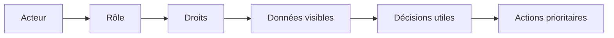
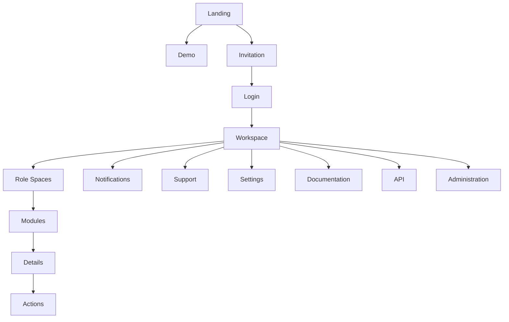
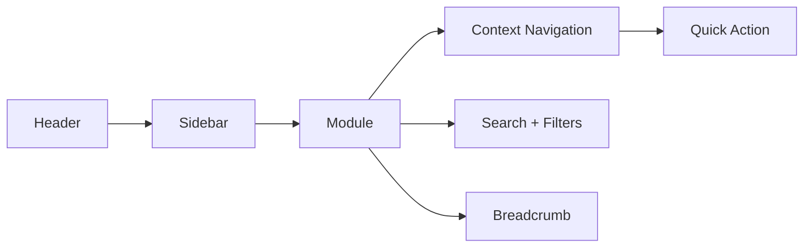
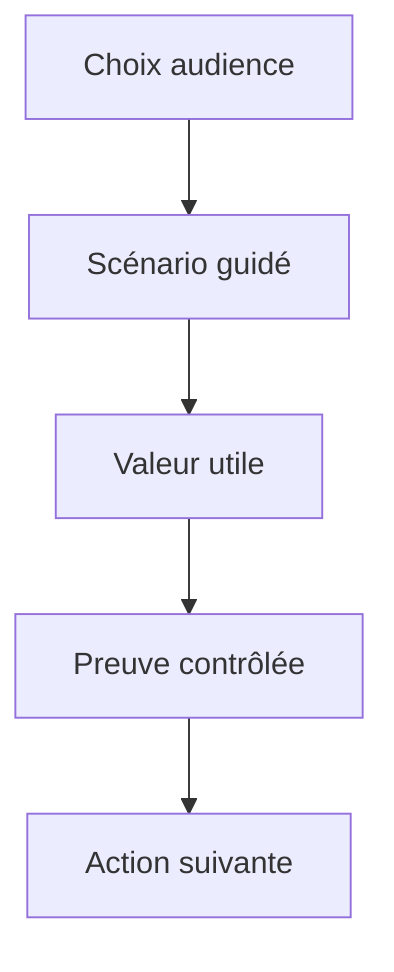
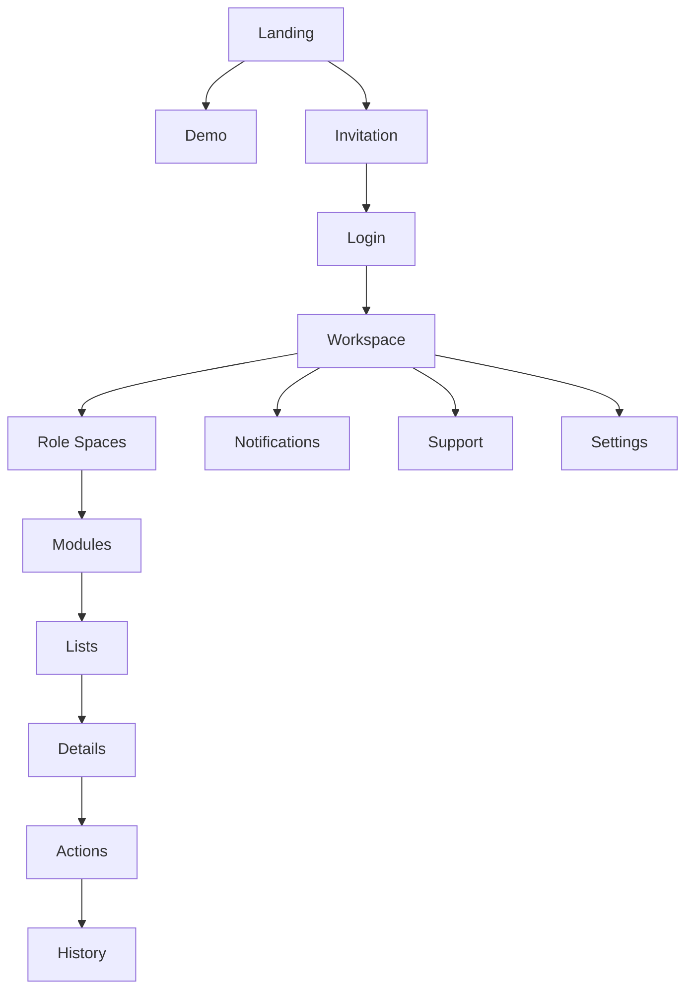
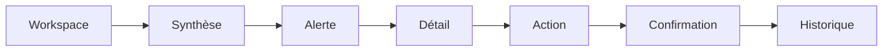

# Mbàmbulaan UX Information Architecture v1.0

## Statut du document

Ce document devient la référence UX officielle de Mbàmbulaan. Tous les futurs écrans devront respecter cette architecture d'information, ce modèle de navigation et ces règles d'interaction.

Il s'appuie sur le Product Blueprint, la Functional Architecture, le Business Model et les Actor Journeys. Il ne décrit aucun composant React, aucune implémentation technique et aucun design system visuel.

## 1. Introduction

Mbàmbulaan n'est pas :

- un site web ;
- un logiciel classique ;
- un ERP ;
- un tableau de bord isolé.

Mbàmbulaan est une plateforme adaptative.

Chaque acteur voit un produit différent. Un pêcheur ne doit pas voir la même plateforme qu'un ministère. Une collectivité ne doit pas voir la même expérience qu'un exportateur. Un visiteur ne doit jamais voir le produit opérationnel réel.

L'UX de Mbàmbulaan repose donc sur trois idées :

1. Le rôle définit l'expérience.
2. Le contexte définit les données visibles.
3. La prochaine action définit la navigation.

## 2. UX Principles

| Principe | Définition | Règle d'application |
| --- | --- | --- |
| One Action Principle | Une vue doit porter une action dominante | Ne jamais afficher deux CTA principaux concurrents |
| Progressive Disclosure | Montrer d'abord l'essentiel, révéler le détail ensuite | Les détails avancés restent secondaires ou contextuels |
| Context First | Le rôle, le quai, la zone, le lot ou le besoin doivent cadrer la vue | Aucun écran générique sans contexte explicite |
| Decision First | L'information doit conduire vers une décision | Un KPI sans décision associée est inutile |
| No Dead End | Chaque écran propose une suite logique | Toujours afficher une action suivante, un retour ou un contact |
| No Empty Screen | Un écran vide explique quoi faire | Proposer création, import, aide ou demande d'accès |
| No Long Menu | La navigation doit rester courte | Maximum 7 entrées principales visibles |
| Minimum Clicks | Les actions fréquentes doivent être rapides | Les tâches critiques doivent tenir en 1 à 3 étapes |
| No Cognitive Overload | Réduire la charge mentale | Masquer les données non utiles au rôle |
| Always Next Action | L'utilisateur doit savoir quoi faire après | Chaque page affiche une action prioritaire ou une recommandation |
| Role Based UX | L'expérience dépend du rôle | Les menus, widgets et CTA changent selon l'acteur |
| Mobile First | Le terrain utilise souvent mobile et petits écrans | Les actions critiques doivent rester mobiles |
| Offline First | Certaines zones peuvent être instables | Prévoir saisie différée, brouillons et confirmation future |
| WhatsApp First | L'adoption terrain commence par des canaux familiers | WhatsApp peut déclencher invitation, déclaration ou notification |

## 3. Global Information Architecture

L'architecture globale sépare la découverte publique, les démos, les espaces de travail, l'administration et les services transverses.

| Zone | Objectif | Public concerné | Données visibles |
| --- | --- | --- | --- |
| Landing | Expliquer la vision, la valeur et les preuves publiques | Visiteurs, partenaires, investisseurs | Données publiques et agrégées uniquement |
| Demo | Montrer un scénario adapté à l'audience | Prospects, institutions, partenaires | Données fictives ou anonymisées |
| Login | Authentifier et router vers l'espace adapté | Acteurs invités ou enregistrés | Aucune donnée métier avant connexion |
| Invitation | Transformer un contact en acteur identifié | Référents, partenaires, organisations | Données d'invitation et rôle proposé |
| Workspace | Donner l'accueil opérationnel personnalisé | Tous les acteurs connectés | Données autorisées par rôle et contexte |
| Role Spaces | Présenter les actions propres à chaque acteur | Pêcheur, mareyeur, collectivité, etc. | Données filtrées et modules pertinents |
| Administration | Gouverner droits, référentiels, validations | Administrateurs, référents habilités | Données de contrôle selon périmètre |
| Configuration | Gérer territoire, organisation, préférences | Organisations et admins | Paramètres autorisés |
| Notifications | Centraliser alertes et messages d'action | Tous les acteurs connectés | Notifications ciblées |
| Settings | Gérer compte, préférences, sécurité | Tous les acteurs connectés | Données personnelles et préférences |
| Support | Aider, signaler, contacter | Tous les acteurs | Tickets, aide, contact |
| Documentation | Expliquer règles, usages, API et gouvernance | Partenaires, admins, techniques | Documentation adaptée |
| API | Préparer intégrations et exports | Enterprise, institutions, partenaires | Accès sous convention |

## 4. Navigation Model

La navigation doit rester contextuelle. Mbàmbulaan ne doit jamais exposer toute sa profondeur à tous les utilisateurs.

| Élément | Rôle | Quand il apparaît | Règles |
| --- | --- | --- | --- |
| Header | Repère global léger | Toujours, sauf écrans très focalisés | Logo, rôle actuel, notifications, recherche ou aide selon rôle |
| Sidebar | Navigation principale connectée | Workspaces desktop, rôles avancés | 5 à 7 entrées maximum ; masquée ou condensée mobile |
| Context Navigation | Navigation liée à un lot, quai, besoin, territoire ou programme | Pages de détail et vues métier | Affiche uniquement les liens utiles au contexte |
| Quick Actions | Actions fréquentes | Accueil personnalisé et modules opérationnels | Déclarer, publier, réserver, valider, contacter |
| Breadcrumb | Orientation dans les niveaux profonds | Détails, administration, executive | Court, lisible, non décoratif |
| Search | Recherche locale | Listes, modules, données nombreuses | Recherche dans le périmètre visible uniquement |
| Filters | Réduction d'une liste | Arrivages, besoins, opportunités, notifications, transactions | Filtres métier, pas filtres gadgets |
| Global Search | Recherche transverse | Rôles avancés, admins, institutions | Respecte strictement les droits |
| Pinned Actions | Actions épinglées par rôle | Workspaces quotidiens | Maximum 3 actions |
| Floating Actions | Action mobile urgente | Mobile, terrain, déclaration rapide | Une seule action flottante à la fois |

## 5. Role Based Navigation

| Rôle | Accueil | Menu | Widgets | CTA principal | Navigation |
| --- | --- | --- | --- | --- | --- |
| Visiteur | Landing publique | Vision, cas d'usage, démo, rendez-vous | Chiffres publics, carte illustrative, témoignages | Demander une démo | Navigation marketing courte |
| Pêcheur | Lots et notifications | Arrivages, Opportunités, Transactions, Notifications | Lots déclarés, réservations, qualité | Déclarer un arrivage | Navigation actionnelle mobile |
| Mareyeur | Besoins et lots disponibles | Arrivages, Besoins, Opportunités, Transactions | Besoins ouverts, lots compatibles | Publier un besoin | Navigation commerciale |
| Coopérative | Activité membres | Membres, Arrivages, Besoins, Opportunités, Impact | Volumes membres, alertes, transactions | Mutualiser une action | Navigation organisationnelle |
| Collectivité | Territoire | Quais, Dashboard, Coordination, Notifications | Tensions, impact, alertes | Prioriser une action | Navigation territoriale |
| ONG | Zones sensibles | Dashboard, Quais, Alertes, Impact | Lots sensibles, pertes évitées, zones | Cibler une intervention | Navigation programme |
| Entreprise | Approvisionnement | Besoins, Opportunités, Transactions, Qualité | Lots recommandés, transactions, fournisseurs | Réserver un lot | Navigation achat |
| État | Lecture nationale | Executive, Dashboard, Quais, Programmes | Couverture, tensions, risques | Suivre une priorité | Navigation institutionnelle |
| Ministère | Synthèse stratégique | Executive, Territoires, Impact, Risques | Décisions, investissements, impact | Arbitrer une priorité | Navigation décisionnelle |
| Investisseur | Démo et traction | Traction, Impact, Business, Risques | KPI business, adoption, territoires | Demander due diligence | Navigation preuve |
| Administrateur | Contrôle | Administration, Référentiels, Droits, Validations | Anomalies, validations, intégrations | Traiter une anomalie | Navigation gouvernance |

## 6. Landing Experience

La landing n'est pas le produit. Elle est une expérience de confiance et de compréhension.

Le visiteur découvre : Vision, Valeur, Cas d'usage, Vidéos, Cartographie illustrative, KPIs publics, Success stories, Prendre rendez-vous, Demander une démo, Créer un compte ou demander une invitation.

Il ne voit jamais les vraies données.

| Section landing | Mission | CTA |
| --- | --- | --- |
| Hero | Expliquer la promesse territoriale | Demander une démo |
| Problème | Montrer la fragmentation actuelle | Comprendre la coordination |
| Solution | Présenter Mbàmbulaan comme plateforme adaptative | Voir la démo |
| Cas d'usage | Rendre la valeur concrète par acteur | Choisir un cas |
| Carte illustrative | Montrer l'ancrage territorial | Explorer les quais pilotes |
| KPIs publics | Donner des preuves non sensibles | Voir l'impact |
| Témoignages | Créer la confiance | Prendre rendez-vous |
| Contact | Convertir l'intérêt | Envoyer une demande |

## 7. Demo Experience

La démo n'est pas une copie du produit. Elle est une narration guidée, filtrée par audience.

| Scénario | Audience | Valeur révélée | Modules montrés |
| --- | --- | --- | --- |
| Démo Investisseur | Investisseurs, incubateurs | Traction, scalabilité, revenus, impact | Executive, Dashboard, Démo |
| Démo État | Administration publique | Lecture nationale, risques, impact, priorités | Executive, Quais, Dashboard |
| Démo ONG | ONG, bailleurs | Zones vulnérables, actions ciblées, impact | Quais, Coordination, Impact |
| Démo Collectivité | Collectivités | Tensions locales, carte, priorités | Quais, Notifications, Dashboard |
| Démo Entreprise | Acheteurs, entreprises | Approvisionnement, qualité, transactions | Arrivages, Opportunités, Transactions |
| Démo Coopérative | Organisations terrain | Membres, volumes, mutualisation | Espaces, Arrivages, Besoins |
| Démo Partenaire technique | API, data, intégrations | Gouvernance, sources, interopérabilité | Documentation, API, Administration |

## 8. Workspace Experience

Le workspace est l'accueil connecté. Il doit répondre à trois questions : Que se passe-t-il maintenant ? Qu'est-ce qui me concerne ? Quelle action dois-je faire ?

| Bloc | Rôle |
| --- | --- |
| Accueil | Résumer le rôle, le territoire ou l'organisation |
| Vue synthétique | Montrer 3 à 5 signaux utiles |
| Actions | Afficher les actions les plus importantes |
| Historique | Donner confiance par la mémoire des événements |
| Alertes | Prioriser ce qui demande attention |
| Opportunités | Montrer les correspondances utiles |
| Décisions | Transformer les signaux en choix |

## 9. Page Inventory

| Page future | Objectif | Utilisateur | Entrée | Sortie | CTA principal |
| --- | --- | --- | --- | --- | --- |
| Landing | Comprendre Mbàmbulaan | Visiteur | Accès public | Intérêt qualifié | Demander une démo |
| Démo | Montrer un scénario | Prospect | Landing ou invitation | Compréhension ciblée | Voir scénario |
| Login | Authentifier | Tous | Invitation ou compte | Workspace | Se connecter |
| Invitation | Activer un rôle | Invité | Lien invitation | Compte initial | Accepter invitation |
| Workspace | Résumer l'action du jour | Connecté | Login | Action prioritaire | Faire l'action |
| Espace pêcheur | Servir le pêcheur | Pêcheur | Workspace | Arrivage ou suivi | Déclarer un arrivage |
| Espace mareyeur | Servir l'achat | Mareyeur | Workspace | Besoin ou réservation | Publier un besoin |
| Espace coopérative | Coordonner membres | Coopérative | Workspace | Action collective | Mutualiser |
| Espace collectivité | Piloter territoire | Collectivité | Workspace | Priorité locale | Prioriser |
| Espace institution | Lire l'impact | Institution | Workspace | Décision | Voir synthèse |
| Arrivages | Gérer lots | Terrain, acheteurs | Workspace | Lot qualifié | Déclarer |
| Détail arrivage | Comprendre un lot | Acteurs autorisés | Liste arrivages | Décision lot | Suivre ou réserver |
| Besoins | Structurer demandes | Acheteurs | Workspace | Besoin publié | Publier |
| Détail besoin | Comprendre couverture | Acteurs autorisés | Liste besoins | Action de couverture | Voir opportunités |
| Opportunités | Rapprocher offre et besoin | Acteurs autorisés | Matching | Réservation | Réserver |
| Détail opportunité | Expliquer et agir | Parties concernées | Liste opportunités | Transaction | Réserver ou contacter |
| Transactions | Suivre exécution | Parties concernées | Réservation | Statut avancé | Avancer |
| Détail transaction | Voir historique | Parties concernées | Liste transactions | Preuve | Voir traçabilité |
| Notifications | Traiter signaux | Tous connectés | Header ou workspace | Action ou lecture | Marquer traité |
| Quais | Lire territoire | Collectivités, institutions | Workspace | Priorité quai | Voir détail quai |
| Détail quai | Comprendre activité locale | Acteurs territoriaux | Carte | Action locale | Prioriser action |
| Dashboard | Mesurer activité | Rôles avancés | Workspace | Lecture KPI | Voir décision |
| Coordination | Piloter journée | Référents, admins, institutions | Workspace | Décisions opérationnelles | Traiter priorité |
| Executive | Synthèse institutionnelle | Ministère, institution, investisseur | Workspace | Arbitrage | Voir décisions |
| Administration | Gouverner | Admins | Workspace admin | Correction | Traiter anomalie |
| Configuration | Paramétrer | Admins, organisations | Settings | Paramètre actif | Enregistrer |
| Documentation | Comprendre règles | Partenaires, admins | Support ou API | Autonomie | Lire guide |
| API | Préparer intégration | Enterprise, partenaires | Documentation | Convention technique | Demander accès |
| Support | Aider | Tous | Header ou footer | Ticket ou réponse | Contacter support |
| Settings | Gérer compte | Tous | Header | Préférence | Mettre à jour |

## 10. Screen Hierarchy

## 11. UX Rules

| Règle | Application |
| --- | --- |
| Jamais plus de 5 CTA majeurs par vue | Au-delà, regrouper ou hiérarchiser |
| Jamais plus de 7 éléments de menu | Les menus changent selon le rôle |
| Jamais deux actions principales | Une seule action primaire visible |
| Une page = une mission | Éviter les pages fourre-tout |
| Un KPI = une décision | Chaque indicateur doit expliquer l'action possible |
| Un écran vide = une aide | Proposer une création, un exemple ou une demande d'accès |
| Une alerte = une action | Toute alerte critique doit pointer vers une résolution |
| Une recommandation = une explication | Montrer pourquoi elle existe |
| Une donnée sensible = un droit explicite | Ne jamais exposer par défaut |
| Une liste longue = recherche + filtres | Pas de scroll brut interminable |
| Un détail = historique et prochaine action | La traçabilité doit soutenir la confiance |
| Mobile = action prioritaire d'abord | Les analyses longues passent après |

## 12. Anti Patterns

| Anti-pattern interdit | Pourquoi c'est dangereux |
| --- | --- |
| Dashboard vide | Donne l'impression d'un produit inutile |
| Menu infini | Crée une surcharge et contredit l'UX par rôle |
| Scroll interminable | Cache l'action utile |
| Widgets inutiles | Décor sans décision |
| Texte décoratif | Ajoute de la charge sans valeur |
| KPIs sans action | Transforme Mbàmbulaan en tableau passif |
| Démo qui montre tout | Dilue la valeur par audience |
| Même navigation pour tous | Contredit la plateforme adaptative |
| Données réelles en public | Détruit la confiance |
| Filtres techniques | Éloigne des décisions métier |
| Actions cachées en bas de page | Ralentit les tâches critiques |
| Notifications sans priorité | Crée du bruit et fatigue l'utilisateur |

## 13. UX Decision Checklist

Avant de développer un écran, répondre obligatoirement :

1. Quel acteur utilise cet écran ?
2. Quelle mission unique sert-il ?
3. Quelle donnée est visible et pourquoi ?
4. Quelle donnée doit rester invisible ?
5. Quelle décision l'écran aide-t-il à prendre ?
6. Quelle est l'action principale ?
7. Quelle est l'action suivante si l'écran est vide ?
8. Quel moteur métier alimente la vue ?
9. Quels droits sont nécessaires ?
10. Quelle version mobile de l'action existe ?
11. Le parcours peut-il fonctionner avec faible connectivité ?
12. La vue respecte-t-elle les limites de menu, CTA et charge cognitive ?

## 14. Open Questions

- Le visiteur doit-il pouvoir lancer une démo interactive ou seulement guidée ?
- Quels rôles ont accès à une recherche globale ?
- Quels modules doivent être visibles en mobile terrain dès la première version ?
- Quelle part de l'expérience peut passer par WhatsApp avant connexion ?
- Quels niveaux de détail les institutions peuvent-elles voir sans mandat nominatif ?

## 15. Décisions restantes

- Définir les menus exacts par rôle avant toute refonte UI.
- Définir les 3 actions épinglées par rôle.
- Définir les scénarios de démo prioritaires.
- Définir les écrans qui nécessitent un mode offline.
- Définir les règles de visibilité des KPI publics.

## 16. Risques UX

| Risque | Effet | Mitigation |
| --- | --- | --- |
| Trop de modules visibles | Confusion et abandon | Navigation par rôle stricte |
| Démo trop proche du produit réel | Exposition de données ou complexité inutile | Scénarios contrôlés |
| Trop de KPI | Lecture passive | KPI reliés aux décisions |
| Expérience trop institutionnelle | Faible adoption terrain | Mobile First et WhatsApp First |
| Expérience trop terrain | Faible crédibilité financeurs | Executive et preuves agrégées |
| Administration trop large | Risque confiance | Journalisation et droits contextuels |
