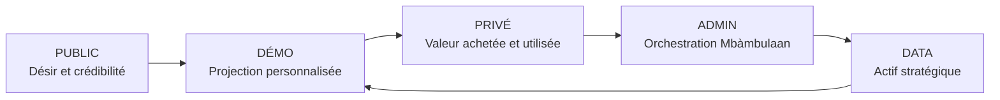
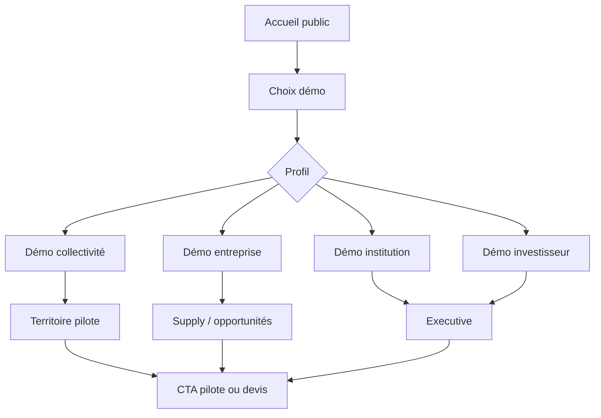

# Mbàmbulaan UX Target & Information Architecture v2.0

## 1. Statut du document

Ce document fige l'UX cible complète de Mbàmbulaan avant Design System et reprise du développement. Il devient la référence pour l'architecture d'information, la landing publique, les démos personnalisées, les espaces privés, l'administration, les wireframes textuels, les états UX, la conversion et les règles de contenu.

La landing publique est une vitrine stratégique, pas l'application. Elle crée désir, crédibilité et envie de demander une démo ou un devis. Elle ne doit jamais dévoiler tout l'intérieur du produit.

Les démos sont personnalisées par partie prenante. Elles simulent ce qu'un acteur pourrait voir si Mbàmbulaan lui est vendu, déployé, conventionné ou présenté en phase avancée.

Les espaces privés sont réservés aux acteurs acquis : clients, partenaires, pilotes, institutions, organisations ou équipes Mbàmbulaan. Ils représentent la valeur réellement livrée.

L'UX doit protéger la valeur du produit. Elle ne doit pas transformer Mbàmbulaan en dashboard public, marketplace ouverte, ERP sectoriel ou collection de pages visibles par tous.

## 2. Objectif UX

L'UX cible doit permettre de :

- comprendre Mbàmbulaan en moins de 5 minutes ;
- susciter l'intérêt sans dévoiler toute la plateforme ;
- donner envie de demander une démo, un devis ou un pilote ;
- montrer que Mbàmbulaan est un Operating System de coordination ;
- différencier clairement public, démo, privé, admin et data ;
- personnaliser la démonstration selon le profil ;
- rendre visible la valeur achetée dans les espaces privés ;
- transformer des signaux terrain en décisions exploitables ;
- rendre les preuves, sources et limites compréhensibles ;
- préparer la commercialisation future sans surpromesse.

La promesse UX : faire sentir que Mbàmbulaan n'affiche pas seulement des données, mais orchestre une filière.

## 3. Principes UX non négociables

| Principe | Règle UX |
| --- | --- |
| La landing vend une transformation | Elle parle d'impact, de coordination et de décision, pas d'une liste exhaustive de modules |
| La landing ne dévoile pas le produit complet | Les écrans métier restent en aperçu contrôlé ou en démo guidée |
| Chaque démo est contextualisée | État, collectivité, ONG, entreprise, exportateur ou investisseur ne voient pas le même récit |
| Pas de données sensibles en public | Aucun nom réel, volume réel, acteur réel ou donnée opérationnelle privée hors cadre |
| Chaque écran privé justifie sa valeur | Une page privée doit aider à agir, décider, prouver ou rendre compte |
| Une action principale par écran | Pas de double CTA dominant ni de menus confus |
| Chaque donnée a une source ou une limite | Déclaratif, estimé, validé, système ou audité doit être visible quand nécessaire |
| Pas de dashboard décoratif | Un KPI doit mener vers une décision ou une action |
| Pas de carte décorative | Une carte doit expliquer où agir, pourquoi et avec quel niveau de tension |
| Pas de marketplace déguisée | Opportunité, qualité, preuve, tension et action doivent être aussi visibles que l'achat |
| Pas de jargon inutile | Les termes métier sont expliqués et les phrases restent courtes |
| Pas de surpromesse | L'impact estimé reste présenté comme estimé |
| Pas de fausse certification | Le mot certification est réservé aux preuves officielles futures |
| L'impact n'est pas officiel s'il est estimé | Les chiffres démonstratifs doivent être cadrés comme mock, estimés ou simulés |

## 4. Architecture d'accès

L'architecture UX cible respecte cinq niveaux :

### 4.1 Public

Objectif : créer confiance, désir, compréhension et demande de démo ou de devis.

Pages publiques :

- Accueil ;
- Vision ;
- Solutions ;
- Cas d'usage ;
- Impact ;
- À propos ;
- Contact ;
- Demander une démo ;
- Demander un devis.

Règle : ne jamais exposer l'intégralité de l'outil ni donner l'impression d'une application gratuite ouverte.

### 4.2 Démo personnalisée

Objectif : projeter une partie prenante dans ce qu'elle pourrait voir si Mbàmbulaan lui était vendu, déployé ou conventionné.

Types de démos :

- Démo État / Ministère ;
- Démo Collectivité ;
- Démo ONG / Programme ;
- Démo Entreprise privée ;
- Démo Exportateur ;
- Démo Organisation professionnelle ;
- Démo Pêcheur / Mareyeur ;
- Démo Investisseur ;
- Démo Partenaire technique.

Règle : une démo n'est pas une copie du produit réel. Elle montre uniquement la valeur utile au segment.

### 4.3 Espace privé

Objectif : livrer la valeur opérationnelle réelle à un acteur acquis.

Espaces privés :

- workspace acteur terrain ;
- workspace acheteur / mareyeur ;
- workspace transformateur ;
- workspace collectivité ;
- workspace institution ;
- workspace entreprise ;
- workspace programme ;
- workspace partenaire ;
- workspace admin Mbàmbulaan.

Règle : l'espace privé n'est ouvert qu'après convention, pilote, offre, forfait, compte validé ou mandat.

### 4.4 Admin Mbàmbulaan

Objectif : orchestrer données, acteurs, qualité, validations, accès, preuves, opérations et configuration.

L'admin est un cockpit interne Mbàmbulaan. Ce n'est ni un espace client, ni une vitrine, ni une zone ouverte aux partenaires.

## 5. Plan de site cible

| Route | Type | Accès | Utilisateur principal | Objectif | CTA principal | Données visibles | Données cachées | Priorité |
| --- | --- | --- | --- | --- | --- | --- | --- | --- |
| `/` | Landing | Public | Visiteur, prospect | Comprendre la promesse | Demander une démo | Vision, bénéfices, aperçus contrôlés | Données réelles, modules complets | MVP |
| `/vision` | Contenu stratégique | Public | Prospect, investisseur | Comprendre l'ambition | Demander une démo | Mission, pourquoi maintenant | Détails opérationnels | MVP |
| `/solutions` | Segmentation | Public | Organisation, entreprise | Reconnaître son cas | Choisir un profil | Familles de solutions | Espace privé complet | MVP |
| `/cas-usages` | Preuve narrative | Public | Prospect | Voir usages typiques | Voir une démo | Scénarios contrôlés | Données sensibles | MVP |
| `/impact` | Crédibilité | Public | Institution, ONG, investisseur | Comprendre impact potentiel | Demander rapport démo | Indicateurs estimés | Impact officiel | MVP |
| `/contact` | Conversion | Public | Tout prospect | Contacter Mbàmbulaan | Envoyer demande | Formulaire | Données produit | MVP |
| `/demande-demo` | Conversion | Public | Prospect qualifié | Demander démo | Soumettre | Profil, objectif, contact | Accès produit | MVP |
| `/devis` | Conversion commerciale | Public | Client potentiel | Demander proposition | Demander devis | Besoin, segment, territoire | Tarifs publics détaillés | MVP |
| `/demo` | Hub démo | Démo | Prospect avancé | Choisir scénario | Choisir profil | Scénarios et récit | Produit complet | MVP |
| `/demo/etat` | Démo personnalisée | Démo | État, ministère | Voir pilotage sectoriel | Demander échange institutionnel | Agrégats simulés | Nominatifs | V1 |
| `/demo/collectivite` | Démo personnalisée | Démo | Collectivité | Voir territoire pilote | Demander pilote | Quais, tensions, actions | Données privées | MVP |
| `/demo/ong` | Démo personnalisée | Démo | ONG, programme | Voir impact prudent | Demander cadrage programme | Actions, indicateurs | Données personnelles | V1 |
| `/demo/entreprise` | Démo personnalisée | Démo | Entreprise | Voir supply intelligence | Demander devis | Lots simulés, qualité | Stock garanti | V1 |
| `/demo/exportateur` | Démo personnalisée | Démo | Exportateur | Voir traçabilité | Demander échange | Qualité, preuves | Certification officielle | V1 |
| `/demo/acteur-terrain` | Démo personnalisée | Démo | Pêcheur, mareyeur | Voir simplicité terrain | Tester pilote | Signal, besoin, retour | Admin, data complète | MVP |
| `/demo/investisseur` | Démo personnalisée | Démo | Investisseur | Voir ambition et modèle | Demander data room | Impact, modèle, risques | Données confidentielles | MVP |
| `/demo/partenaire-technique` | Démo personnalisée | Démo | Partenaire technique | Voir gouvernance data | Cadrer intégration | Exports simulés | API réelle | V2 |
| `/territoire-pilote` | Scénario territoire | Démo | Collectivité, CEO, partenaire | Montrer Joal / Petite-Côte | Lancer pilote | Signal, tension, action, preuve | Données réelles | MVP |
| `/workspace` | Accueil privé | Privé | Acteur validé | Voir priorités personnelles | Agir maintenant | Données autorisées | Autres rôles | V1 |
| `/arrivages` | Module opérationnel | Privé / démo | Terrain, acheteur | Voir signaux et lots | Déclarer / qualifier | Lots autorisés | Données sensibles | MVP |
| `/besoins` | Module opérationnel | Privé / démo | Mareyeur, entreprise | Structurer demande | Publier besoin | Besoins autorisés | Besoins privés tiers | MVP |
| `/opportunites` | Module coordination | Privé / démo | Acheteur, animateur | Voir correspondances | Consulter opportunité | Scores, raisons | Données non autorisées | MVP |
| `/opportunites/[id]` | Détail | Privé / démo | Acteur concerné | Comprendre recommandation | Coordonner / réserver | Offre, besoin, preuve | Contacts non autorisés | MVP |
| `/coordination` | Cockpit | Privé / démo | Animateur, admin local | Prioriser actions | Traiter action | File, alertes, décisions | Tout système | MVP |
| `/executive` | Synthèse | Privé / démo | Décideur | Décider ou financer | Demander rapport | KPI, risques, limites | Données brutes | MVP |
| `/rapports` | Reporting | Privé | Institution, programme | Exporter synthèse | Générer rapport | Agrégats et preuves | Nominatifs | V1 |
| `/admin` | Cockpit interne | Admin | Admin Mbàmbulaan | Superviser | Traiter anomalies | Système interne | Public | MVP |
| `/admin/acteurs` | Admin | Admin | Admin, data manager | Gérer acteurs | Valider acteur | Profils, statuts | Public | MVP |
| `/admin/donnees` | Admin | Admin | Data manager | Contrôler qualité | Corriger donnée | Sources, anomalies | Public | MVP |
| `/admin/territoires` | Admin | Admin | Admin territoire | Configurer zones | Mettre à jour | Quais, zones, règles | Public | V1 |
| `/admin/audit` | Admin | Admin | Admin, compliance | Suivre historique | Examiner événement | Logs, preuves | Public | V1 |

Routes cadrées : 31.

## 6. Landing publique - wireframe stratégique

La landing est une page premium de solution. Elle doit être claire, ambitieuse, sobre, orientée valeur, et ne jamais dévoiler tout le produit.

### Hero

Objectif : comprendre en 10 secondes que Mbàmbulaan est l'Operating System de coordination de la pêche artisanale sénégalaise.

Contenu :

- promesse principale : coordonner la pêche artisanale, du signal terrain à la décision ;
- sous-titre : relier acteurs, lots, besoins, territoires, preuves et impact ;
- CTA principal : Demander une démo ;
- CTA secondaire : Découvrir la vision ;
- pas de liste exhaustive de fonctionnalités ;
- pas d'accès direct aux modules privés.

### Problème

Montrer : filière fragmentée, information dispersée, décisions difficiles, pertes de valeur, coordination insuffisante.

### Transformation

Montrer : signaux -> données fiables -> coordination -> décisions -> impact -> nouveaux services.

### Pour qui

Présenter les familles d'acteurs sans donner accès direct aux outils : terrain, marché, territoires, institutions, entreprises, financeurs, partenaires.

### Ce que Mbàmbulaan rend possible

Parler en capacités, pas en fonctionnalités : coordonner un territoire, qualifier un signal, relier offre et besoin, suivre une action, produire une preuve, piloter un programme, créer de nouveaux services.

### Aperçu contrôlé

Montrer quelques aperçus visuels : territoire pilote, tension, preuve, synthèse décisionnelle. Ne jamais montrer tous les modules.

### Appel à l'action

CTA : Demander une démo, Demander un devis, Présenter un projet pilote.

À ne pas faire : afficher toutes les pages métier, donner l'impression d'une app gratuite, lister tous les modules comme un ERP, faire une marketplace publique, montrer des données sensibles, utiliser des textes longs.

## 7. Démo personnalisée - architecture

Chaque démo doit suivre la même structure : contexte acteur, problème spécifique, scénario simulé, données visibles, décisions possibles, preuves, valeur livrée, limites, CTA commercial.

| Démo | Objectif | Données visibles | Décisions possibles | Preuves | Limites | CTA commercial |
| --- | --- | --- | --- | --- | --- | --- |
| État / Ministère | Montrer pilotage sectoriel, tensions, impact, priorités, programmes | Agrégats, cartes, risques, impact estimé | Cibler un territoire, financer un programme | Sources, indicateurs, limites | Pas de détails nominaux sensibles | Demander échange institutionnel |
| Collectivité | Montrer quais, territoire, tensions, actions, preuves, synthèse locale | Quais, niveaux de tension, actions, rapport local | Prioriser un quai, mobiliser acteurs | Signal, action, synthèse | Pas de données privées hors mandat | Lancer pilote territorial |
| ONG / Programme | Montrer bénéficiaires, actions, indicateurs, reporting prudent | Actions, zones, impact estimé | Cibler appui, mesurer progrès | Sources, preuves d'action | Impact non audité | Cadrer programme |
| Entreprise privée | Montrer supply intelligence, lots, qualité, opportunités, risques | Lots simulés, besoins, qualité, risques | Publier besoin, coordonner lot | Score qualité, matching | Pas de garantie volume | Demander devis supply |
| Exportateur | Montrer traçabilité, qualité, preuve, conformité future sans surpromesse | Historique lot, qualité, acteurs, preuves | Préqualifier lot | Timeline, proof level | Pas de certification officielle | Cadrer traçabilité |
| Organisation professionnelle | Montrer membres, volumes, coordination, réputation, actions collectives | Agrégats membres, volumes, actions | Coordonner territoire ou GIE | Validations, synthèse | Pas de gouvernance nationale immédiate | Discuter convention |
| Pêcheur / Mareyeur | Montrer simplicité, signal, besoin, opportunité, suivi, preuve | Signal, besoin, notification, opportunité | Déclarer ou publier besoin | Confirmation et statut | Pas de back-office complet | Tester pilote terrain |
| Investisseur | Montrer ambition, défensibilité, modèle économique, données, adoption | Vision, valeur capturable, pilotes | Continuer diligence | Product book, démo, métriques | Données simulées assumées | Demander data room |
| Partenaire technique | Montrer gouvernance data, intégrations futures, exports, accès | Référentiels, exports simulés, droits | Cadrer intégration | Sources, logs futurs | API avancée non MVP | Atelier technique |

## 8. Espaces privés - UX cible

| Espace | Objectif | Utilisateur | Valeur achetée ou reçue | Données visibles | Données cachées | Actions principales | CTA | Navigation | États vides | Preuves | Métriques |
| --- | --- | --- | --- | --- | --- | --- | --- | --- | --- | --- | --- |
| Terrain | Capturer et qualifier les signaux | Pêcheur référent, agent, responsable quai | Visibilité, preuve, opportunité | Ses signaux, lots, statuts | Autres acteurs privés | Déclarer, qualifier, corriger, suivre | Déclarer signal | Accueil, arrivages, notifications | Aucun signal : expliquer canal | Source, statut, validation | Signaux, délais, validations |
| Demande / marché | Structurer la demande et activer opportunités | Mareyeur, transformateur, entreprise | Besoins, matching, qualité | Besoins, opportunités, qualité | Besoins concurrents privés | Publier besoin, suivre qualité, coordonner | Publier besoin | Besoins, opportunités, transactions | Aucun besoin : CTA publier | Besoin, score, confirmation | Couverture, réservations |
| Territoire | Piloter quais, tensions et actions | Collectivité, animateur | Décision locale, rapport | Quais, tensions, actions, synthèse | Données nominatives hors mandat | Voir quais, tensions, preuves | Traiter priorité | Carte, coordination, executive | Aucune tension : surveiller | Niveau tension, action | Actions, tensions, rapports |
| Institution / programme | Lire agrégats et reporter | État, ONG, bailleur | Redevabilité et arbitrage | Agrégats, programmes, impact, limites | Nominatifs et détails non autorisés | Lire, filtrer, générer rapport | Générer rapport | Executive, rapports, territoires | Aucun programme : créer cadre | Sources, limites, proof levels | Impact, actions, couverture |
| Entreprise | Sécuriser supply et risques | Entreprise, exportateur | Lots qualifiés, opportunités, trace | Lots autorisés, qualité, besoins | Données autres clients | Publier besoin, suivre lot | Cadrer besoin | Supply, opportunités, rapports | Aucun lot : créer alerte | Qualité, trace, matching | Lots qualifiés, délais |
| Admin Mbàmbulaan | Orchestrer système | Admin, support, data manager | Qualité, sécurité, opérations | Tous objets autorisés internes | Public | Gérer acteurs, données, validations, accès | Traiter anomalie | Admin, acteurs, données, audit | Aucune anomalie : surveiller | Logs, validation, audit | Erreurs, SLA, corrections |

## 9. Parcours public vers commercial

Séquence : Visiteur -> landing -> compréhension -> demande de démo -> qualification -> démo personnalisée -> proposition pilote, forfait, convention ou devis.

| Étape | CTA | Champs / données | Qualification | Routage | Suite commerciale |
| --- | --- | --- | --- | --- | --- |
| Landing | Demander une démo | Aucun au départ | Segment implicite par clic | Public | Page demande |
| Formulaire démo | Soumettre demande | Nom, organisation, rôle, email, téléphone, objectif, territoire, segment | Segment, urgence, budget probable | Sales / CEO | Email confirmation |
| Qualification | Planifier échange | Besoin, échéance, décideur, capacité à payer | Score commercial | CRM futur | Démo personnalisée |
| Démo | Demander pilote / devis | Scénario consulté, objections | Fit segment | Sales | Proposition |
| Proposition | Valider pilote | Scope, territoire, livrables | Faisabilité | Contrat | Onboarding privé |

Email de confirmation : remercier, rappeler le segment choisi, annoncer la prochaine étape, ne pas promettre d'accès immédiat au produit complet.

## 10. Parcours démonstration

Parcours cible : Accueil -> Demander ou ouvrir démo -> Choisir profil -> Démo personnalisée -> Territoire ou scénario -> Valeur livrée -> CTA devis ou pilote.

Règle : ne pas imposer la même démo à tous les prospects.

## 11. Wireframes textuels publics

| Page | Objectif | Sections | Contenu | CTA | Données interdites | Erreur à éviter |
| --- | --- | --- | --- | --- | --- | --- |
| `/` | Donner l'ADN et convertir | Hero, problème, transformation, pour qui, aperçu, CTA | Promesse Operating System, teaser visuel, valeur | Demander une démo | Données réelles, modules complets | Ressembler à un dashboard public |
| `/vision` | Expliquer l'ambition | Mission, pourquoi maintenant, positionnement, principes | Coordination, infrastructure, confiance | Demander échange | Roadmap confidentielle | Faire un manifeste trop long |
| `/solutions` | Orienter par segment | Cartes segments, valeur, preuves attendues | Collectivité, ONG, entreprise, institution, terrain | Voir démo adaptée | Accès privé | Lister des fonctionnalités brutes |
| `/cas-usages` | Montrer des scénarios | Cas territoire, supply, impact, trace | Avant / après, acteurs, résultat | Choisir cas | Données nominatives | Promettre résultats garantis |
| `/impact` | Crédibiliser prudemment | Indicateurs potentiels, méthode, limites | Volumes, valeur, pertes évitées estimées | Demander rapport démo | Impact officiel | Confondre estimé et audité |
| `/contact` | Permettre contact | Formulaire, coordonnées, objet | Nom, organisation, message | Envoyer | Accès produit complet | Formulaire trop long |
| `/demande-demo` | Qualifier demande | Segment, objectif, territoire, échéance | Champs utiles pour Sales | Soumettre demande | Données opérationnelles sensibles | Donner accès automatique |
| `/devis` | Cadrer achat | Offre souhaitée, périmètre, territoire, budget indicatif | Projet pilote, organisation, délais | Demander devis | Prix publics définitifs | Transformer en e-commerce |

## 12. Wireframes textuels démos

| Page | Objectif | Scénario | Modules visibles | Données mockées | Preuve | Valeur montrée | CTA final |
| --- | --- | --- | --- | --- | --- | --- | --- |
| `/demo` | Orienter vers la bonne démo | Choix de profil et flux signal -> décision | Démo, territoire, executive | Slice MVP | Proof levels | Compréhension globale | Choisir profil |
| `/demo/etat` | Montrer pilotage sectoriel | Zones sous tension et arbitrage | Executive, carte, rapports | Agrégats pays simulés | Sources et limites | Décision publique | Demander échange |
| `/demo/collectivite` | Montrer territoire pilotable | Joal / Petite-Côte | Territoire, coordination, executive | Quais, tension, actions | Signal et synthèse | Priorisation locale | Lancer pilote |
| `/demo/ong` | Montrer programme et impact | Réduction pertes ou inclusion | Coordination, impact, rapports | Actions, bénéficiaires agrégés | Impact estimé | Reporting prudent | Cadrer programme |
| `/demo/entreprise` | Montrer supply | Besoin entreprise relié à lot | Besoins, opportunités, qualité | Lots, score qualité | Matching | Supply intelligence | Demander devis |
| `/demo/exportateur` | Montrer trace | Lot qualifié de bout en bout | Opportunité détail, trace, qualité | Timeline lot | Preuves limitées | Préqualification | Cadrer traceabilité |
| `/demo/acteur-terrain` | Montrer simplicité | Pêcheur signale, mareyeur reçoit | Arrivages, besoins, notifications | Signal, besoin | Validation humaine | Inclusion terrain | Tester pilote |
| `/demo/investisseur` | Montrer modèle et ambition | Operating System -> offres -> scale | Landing, territory, executive | KPI et revenus simulés | Product Book, limites | Défensibilité | Demander data room |
| `/demo/partenaire-technique` | Montrer intégration future | Donnée qualifiée vers export | Data, admin, exports futurs | Référentiels | Sources et droits | Gouvernance data | Atelier technique |
| `/territoire-pilote` | Montrer Joal pilotable | Signal -> tension -> action -> preuve -> synthèse | Territoire, coordination, executive | Joal / Petite-Côte | Signal validé, synthèse système | Valeur territoire | Demander pilote |

## 13. Wireframes textuels privés

| Page | Objectif | Utilisateur | Données visibles | Action principale | Lien avec l'Operating System | Preuve | États vides | Erreurs à éviter |
| --- | --- | --- | --- | --- | --- | --- | --- | --- |
| `/workspace` | Accueil privé personnalisé | Acteur connecté | Priorités, notifications, actions | Traiter priorité | Agrège modules selon rôle | Sources et statuts | Aucune priorité : proposer action simple | Montrer tout à tous |
| `/arrivages` | Rendre lots visibles | Terrain, acheteur, agent | Lots autorisés, qualité, statut | Déclarer ou qualifier | Point d'entrée signal | Source, heure, validation | Aucun arrivage : déclarer signal | Trop de colonnes |
| `/besoins` | Structurer la demande | Mareyeur, entreprise | Besoins, urgence, couverture | Publier besoin | Alimente matching | Source besoin | Aucun besoin : créer besoin | Confondre demande et commande ferme |
| `/opportunites` | Voir correspondances utiles | Acheteur, animateur | Opportunités, scores, raisons | Ouvrir opportunité | Relie offre, besoin, tension | Score expliqué | Aucune opportunité : expliquer pourquoi | Marketplace pure |
| `/opportunites/[id]` | Comprendre et agir | Acteurs concernés | Offre, besoin, qualité, preuve | Coordonner / réserver selon droits | Décision autour d'un lot | Historique et raisons | Opportunité indisponible : retour liste | Cacher les limites |
| `/coordination` | Prioriser actions | Animateur, admin local | File, alertes, timeline | Traiter action | Orchestration opérationnelle | Action horodatée | Aucune alerte : surveiller | Cockpit saturé |
| `/executive` | Décider et rendre compte | Décideur | KPI, risques, priorités, impact | Générer ou partager synthèse | Traduit flux en décision | Sources et limites | Pas assez de données : expliquer | Dashboard décoratif |
| `/rapports` | Produire livrable | Institution, programme | Rapports, périodes, preuves | Générer rapport | Packager la valeur | Proof levels | Aucun rapport : créer premier périmètre | Rapport sans source |

## 14. Wireframes textuels admin

| Page | Objectif | Sections | Actions | Données visibles | État vide | Erreur à éviter |
| --- | --- | --- | --- | --- | --- | --- |
| `/admin` | Cockpit interne Mbàmbulaan | Santé système, anomalies, tâches, accès rapides | Traiter anomalie | Synthèse interne | Aucune anomalie : surveiller | Exposer aux clients |
| `/admin/acteurs` | Gouverner acteurs | Liste, statuts, rôles, organisations | Valider, suspendre, fusionner | Profils et droits | Aucun acteur à valider | Modifier sans audit |
| `/admin/donnees` | Fiabiliser data | Sources, doublons, erreurs, proof levels | Corriger, qualifier, fusionner | Données brutes et transformées | Aucune erreur | Masquer incertitude |
| `/admin/territoires` | Configurer territoire | Quais, zones, capacités, référentiels | Ajouter, ajuster, désactiver | Référentiel territorial | Aucun territoire | Modifier production sans validation |
| `/admin/audit` | Lire historique | Logs, actions, preuves, exports | Examiner, filtrer | Historique système | Aucun événement | Audit illisible |

## 15. Navigation UX

| Navigation | Règle |
| --- | --- |
| Publique | Menu court : Accueil, Vision, Solutions, Cas d'usage, Impact, Contact, Demander une démo |
| Démo | Sélecteur de profil, parcours guidé, bouton suivant, retour au hub démo |
| Privée | Sidebar ou top nav par rôle, maximum 7 entrées visibles, actions rapides contextuelles |
| Admin | Navigation interne séparée, signal visuel fort, accès limité |
| Mobile | CTA principal visible, menus regroupés, cartes empilées, pas de tableau illisible |
| Fil d'Ariane | Obligatoire dans espaces privés profonds et admin |
| CTA global | Public : Demander démo ; Démo : Demander pilote/devis ; Privé : action métier ; Admin : traiter anomalie |
| Retour | Toujours un retour vers liste, hub ou workspace |
| Différenciation espaces | Couleur, libellé et contexte doivent indiquer Public, Démo, Privé ou Admin |

## 16. États UX

| État | Message | CTA | Ton | Erreur à éviter |
| --- | --- | --- | --- | --- |
| Loading | Chargement des données autorisées | Aucun ou patienter | Calme | Spinner infini sans contexte |
| Empty state | Aucun élément pour ce filtre | Créer ou modifier filtre | Utile | Page vide |
| No proof | Preuve non disponible | Demander validation | Prudent | Faire croire à une preuve |
| Estimated data | Donnée estimée | Voir méthode | Transparent | Présenter comme officielle |
| Validated data | Donnée validée | Utiliser pour décision | Confiant | Ne pas montrer source |
| Access denied | Vous n'avez pas accès à cet espace | Retour workspace | Sobre | Révéler donnée cachée |
| Demo data | Données simulées pour démonstration | Demander pilote réel | Clair | Laisser croire que c'est réel |
| No opportunity | Aucune opportunité compatible | Voir besoins ou arrivages | Actionnable | Message d'échec sec |
| Tension critical | Tension critique détectée | Traiter priorité | Direct | Dramatiser sans action |
| Action pending | Action en attente | Assigner ou relancer | Opérationnel | Statut flou |
| Action completed | Action terminée | Voir preuve | Positif | Oublier historique |
| Report ready | Rapport prêt | Télécharger ou partager | Institutionnel | Rapport sans limites |

## 17. Règles de contenu UX

- Ton institutionnel mais humain.
- Phrases courtes.
- Pas de jargon technique.
- Pas de surpromesse.
- Toujours distinguer démo, réel, estimé, validé et audité.
- Expliquer la preuve en une phrase.
- Expliquer la limite en une phrase.
- Expliquer l'impact estimé sans le rendre officiel.
- Préférer action, source et décision aux slogans.
- Ne jamais dire qu'un lot est certifié si seule une preuve démonstrative existe.
- Ne jamais promettre une couverture nationale avant pilotes.
- Ne jamais présenter Mbàmbulaan comme une marketplace ouverte.

## 18. UX de conversion

| Conversion | Mécanisme UX | Preuve à montrer | Prochaine étape |
| --- | --- | --- | --- |
| Visiteur -> demande de démo | Landing teaser + CTA clair | Transformation et cas d'usage | Formulaire démo |
| Prospect -> rendez-vous | Formulaire court + confirmation | Scénario adapté | Qualification commerciale |
| Partenaire -> pilote | Démo personnalisée | Territoire, action, preuve, limites | Proposition pilote |
| Pilote -> forfait | Rapport de pilote | Usage, valeur, métriques | Devis ou convention |
| Forfait -> relation longue | Workspace privé | Usage récurrent et reporting | Renouvellement |
| Donnée -> service | Proof levels + agrégation | Sources et gouvernance | Offre data/reporting |
| Usage -> revenu | Metrics et adoption | Résultats du client | Upsell ou extension |

## 19. Template premium

Un template premium peut être étudié après clarification UX, mais il ne doit jamais remplacer la vision produit.

### Critères de sélection

- compatible React / Next.js ;
- compatible Tailwind CSS ;
- composants dashboard BI sobres ;
- navigation claire et personnalisable ;
- cartes KPI, timeline, tables, filtres, badges ;
- responsive solide ;
- support de cartes ou panneaux territoriaux ;
- esthétique professionnelle, institutionnelle et moderne ;
- facile à alléger ;
- licence claire.

### Type de template recherché

Un template SaaS B2B / BI / operations dashboard premium, pas une landing startup générique ni une marketplace e-commerce.

### Ce qu'il doit contenir

- landing premium ;
- pages démo ou marketing structurées ;
- layout workspace ;
- dashboard exécutif ;
- tables et filtres ;
- cards KPI ;
- timeline ;
- badges ;
- navigation responsive ;
- formulaires propres.

### Ce qu'il ne doit pas imposer

- marketplace storefront ;
- e-commerce ;
- animations complexes ;
- palette gadget ;
- dépendances lourdes ;
- design trop crypto, trop startup ou trop générique ;
- architecture incompatible avec les moteurs métier.

### Comment éviter que le template remplace la vision

Le template doit être traité comme un kit de composants visuels. La structure produit reste celle de ce document : Public, Démo, Privé, Admin, Data. Les routes, CTA, messages, états UX et limites de preuve priment sur le template.

### Recommandations Next.js / Tailwind

- choisir un template Next.js récent, TypeScript, Tailwind ;
- vérifier la compatibilité App Router ;
- éviter les bibliothèques graphiques non nécessaires ;
- préférer composants copiables et modifiables ;
- auditer accessibilité, responsive et performance avant adoption ;
- ne pas acheter avant validation du Design System.

## 20. Priorités MVP UX

| Priorité | Objet | Raison |
| --- | --- | --- |
| 1 | Landing teaser premium | Créer désir sans exposer tout le produit |
| 2 | Démo personnalisée principale | Expliquer en 5 minutes |
| 3 | Territoire pilote | Montrer Joal / Petite-Côte comme preuve de coordination |
| 4 | Demande de démo / devis | Transformer l'intérêt en pipeline commercial |
| 5 | Navigation claire | Éviter que le CEO ou prospect devine le parcours |
| 6 | Executive summary | Donner une lecture décideur |
| 7 | Pages métier essentielles polishées | Arrivages, besoins, opportunités, coordination |

## 21. Non-objectifs

Ne pas développer ou exposer maintenant :

- accès public complet ;
- self-service complet ;
- marketplace publique ;
- paiement ;
- dashboard national complet ;
- admin complet ;
- API ;
- données réelles sensibles ;
- certification ;
- application mobile native.

## 22. Definition of Done

Ce document est terminé si :

- la landing teaser est entièrement cadrée ;
- les démos personnalisées sont cadrées ;
- les espaces privés sont cadrés ;
- les routes sont claires ;
- les wireframes textuels sont exploitables ;
- la conversion démo/devis est cadrée ;
- le template premium est cadré ;
- Codex peut ensuite produire le Design System sans réinterpréter le produit.

## Synthèse de couverture

| Élément | Couverture |
| --- | --- |
| Routes cadrées | 31 |
| Démos personnalisées | 9 |
| Espaces privés | 6 familles d'espaces, dont admin |
| Wireframes publics | 8 |
| Wireframes démos | 10 |
| Wireframes privés | 8 |
| Wireframes admin | 5 |
| Total wireframes textuels | 31 |
| États UX | 12 |
| Recommandation template | Template premium Next.js / Tailwind de type SaaS B2B / BI / operations dashboard, à sélectionner après Design System |
| Prochaine étape | Phase 6 - Design System complet |
