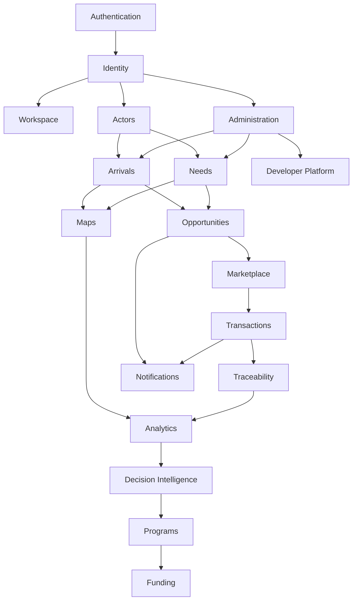

# Mbàmbulaan Product Backlog v1.0

## Statut du document

Ce document devient la référence officielle de développement de Mbàmbulaan. Il transforme la vision produit, l'architecture fonctionnelle, le modèle économique, les parcours acteurs, l'architecture UX et le design system en backlog exécutable.

Il couvre le produit complet, pas seulement le MVP. Il ne contient aucune ligne de code.

## 1. Vision -> Epics

| ID | Epic | Mission | Horizon |
| --- | --- | --- | --- |
| E01 | Landing | Convertir visiteurs et partenaires sans exposer les données réelles | Prototype |
| E02 | Demo | Montrer la valeur par scénario contrôlé | Prototype |
| E03 | Authentication | Sécuriser accès, invitation et connexion | MVP |
| E04 | Identity | Gérer rôles, droits, organisations et espaces | MVP |
| E05 | Workspace | Offrir un accueil contextualisé par rôle | MVP |
| E06 | Actors | Structurer pêcheurs, mareyeurs, coopératives, institutions et partenaires | MVP |
| E07 | Arrivals | Déclarer, qualifier et suivre les arrivages | MVP |
| E08 | Needs | Publier et suivre les besoins | MVP |
| E09 | Opportunities | Détecter, expliquer et activer les opportunités | MVP |
| E10 | Marketplace | Réserver, engager et suivre les mises en relation | V1 |
| E11 | Traceability | Suivre l'historique complet des lots | V1 |
| E12 | Notifications | Alerter les acteurs au bon moment | MVP |
| E13 | Messaging | Faciliter échanges encadrés et canaux terrain | V1.5 |
| E14 | Maps | Lire quais, territoires, tensions et impact | MVP |
| E15 | Analytics | Mesurer activité, impact et performance | MVP |
| E16 | Decision Intelligence | Prioriser, recommander et expliquer les décisions | V1 |
| E17 | Programs | Suivre programmes publics, ONG et partenaires | V1.5 |
| E18 | Funding | Relier besoins territoriaux, acteurs et financeurs | V2 |
| E19 | Administration | Gouverner référentiels, qualité et droits | MVP |
| E20 | AI | Automatiser recommandations, qualité, alertes et analyse | V2 |
| E21 | Offline | Supporter terrain, faible réseau et synchronisation | V1.5 |
| E22 | Settings | Gérer préférences, organisation et sécurité | MVP |
| E23 | Developer Platform | Préparer API, exports et intégrations | V2 |
| E24 | Support | Accompagner adoption, aide et incidents | MVP |

## 2. Features, User Stories et critères d'acceptation

Chaque ligne contient une Feature et sa User Story principale. Les critères d'acceptation suivent le format Given / When / Then.

| ID | Epic | Feature | User Story | Critères d'acceptation | Definition of Done |
| --- | --- | --- | --- | --- | --- |
| S01 | Landing | Promesse publique | En tant que visiteur, je veux comprendre la promesse afin de décider si Mbàmbulaan me concerne | Given visiteur public; When il ouvre la landing; Then il voit vision, valeur et CTA démo | Texte validé, responsive, aucun accès données réelles |
| S02 | Landing | Cas d'usage publics | En tant que prospect, je veux voir des cas d'usage afin de reconnaître ma situation | Given landing; When il consulte les cas; Then chaque acteur a une valeur claire | Cas alignés actor journeys |
| S03 | Landing | Demande de démo | En tant que visiteur, je veux demander une démo afin d'être recontacté | Given formulaire; When il soumet; Then sa demande est confirmée | Validation champs, message succès, consentement |
| S04 | Demo | Démo investisseur | En tant qu'investisseur, je veux une démo traction afin d'évaluer le potentiel | Given scénario investisseur; When lancé; Then KPI, impact et risques sont visibles | Données fictives, récit guidé |
| S05 | Demo | Démo institutionnelle | En tant qu'État ou institution, je veux voir tensions et décisions afin d'évaluer l'utilité publique | Given scénario État; When consulté; Then carte, impact et priorités sont visibles | Données agrégées, aucun nominatif |
| S06 | Demo | Démo entreprise | En tant qu'entreprise, je veux voir approvisionnement et transaction afin de comprendre la valeur opérationnelle | Given scénario entreprise; When consulté; Then lot, besoin, opportunité, transaction sont reliés | Flux complet visible |
| S07 | Authentication | Invitation | En tant qu'acteur invité, je veux activer mon accès afin de rejoindre mon espace | Given lien valide; When accepté; Then rôle et espace sont créés | Invitation expirée gérée |
| S08 | Authentication | Connexion | En tant qu'utilisateur, je veux me connecter afin d'accéder à mes données autorisées | Given identifiants; When connexion réussie; Then workspace adapté s'affiche | Sécurité et erreurs couvertes |
| S09 | Authentication | Récupération accès | En tant qu'utilisateur, je veux récupérer mon accès afin de ne pas bloquer mon activité | Given compte existant; When demande récupération; Then instruction sécurisée envoyée | Parcours testé |
| S10 | Identity | Rôles | En tant qu'administrateur, je veux gérer les rôles afin de limiter les accès | Given acteur; When rôle attribué; Then menus et données changent | Matrice droits appliquée |
| S11 | Identity | Organisations | En tant que coopérative, je veux gérer mes membres afin de suivre l'activité collective | Given organisation; When membre ajouté; Then il hérite du périmètre autorisé | Journalisation |
| S12 | Identity | Vérification acteur | En tant que plateforme, je veux vérifier certains acteurs afin d'augmenter la confiance | Given profil incomplet; When validation faite; Then statut vérifié apparaît | Sources conservées |
| S13 | Workspace | Accueil par rôle | En tant qu'utilisateur connecté, je veux un accueil personnalisé afin de voir mes priorités | Given rôle connu; When workspace ouvert; Then widgets et CTA adaptés s'affichent | Aucun widget inutile |
| S14 | Workspace | Actions épinglées | En tant qu'utilisateur, je veux mes actions fréquentes afin d'agir vite | Given rôle; When workspace chargé; Then maximum 3 actions apparaissent | Conforme UX rules |
| S15 | Workspace | Historique récent | En tant qu'utilisateur, je veux voir l'historique afin de suivre ce qui a changé | Given activité; When accueil ouvert; Then événements récents sont listés | Filtré par droits |
| S16 | Actors | Profil acteur | En tant qu'acteur, je veux voir mon profil afin de comprendre mes droits et données | Given compte; When profil ouvert; Then rôle, organisation, zone visibles | Données modifiables limitées |
| S17 | Actors | Score confiance | En tant qu'acheteur, je veux voir la confiance acteur afin de choisir avec prudence | Given opportunité; When acteur affiché; Then score et explication visibles | Score explicable |
| S18 | Actors | Référents terrain | En tant qu'animateur, je veux identifier référents afin de fiabiliser les données | Given territoire; When liste ouverte; Then référents et statuts visibles | Filtre territoire |
| S19 | Arrivals | Déclaration arrivage | En tant que pêcheur, je veux déclarer un lot afin de le rendre visible | Given formulaire; When soumis; Then lot disponible est créé | Champs obligatoires validés |
| S20 | Arrivals | Qualité lot | En tant qu'utilisateur, je veux connaître la qualité afin de prioriser l'action | Given lot; When affiché; Then score, fraîcheur, risque visibles | Calcul centralisé |
| S21 | Arrivals | Recherche arrivages | En tant qu'acheteur, je veux filtrer les lots afin de trouver les volumes utiles | Given liste; When filtre espèce/quai/statut; Then résultats changent | Mobile lisible |
| S22 | Needs | Publication besoin | En tant que mareyeur, je veux publier un besoin afin de recevoir des opportunités | Given formulaire; When soumis; Then besoin ouvert est créé | Urgence et unité validées |
| S23 | Needs | Priorité besoin | En tant qu'animateur, je veux voir les besoins critiques afin d'agir vite | Given besoins; When liste affichée; Then priorité visible | Critères explicables |
| S24 | Needs | Couverture besoin | En tant qu'acheteur, je veux savoir si mon besoin est couvert afin de décider | Given besoin; When opportunités liées; Then couverture affichée | Statut cohérent |
| S25 | Opportunities | Matching | En tant qu'utilisateur, je veux voir les opportunités afin de relier offre et demande | Given arrivages et besoins; When compatibles; Then opportunités créées | Même espèce et quantité gérées |
| S26 | Opportunities | Explication recommandation | En tant qu'acheteur, je veux comprendre pourquoi une opportunité est proposée | Given opportunité; When détail ouvert; Then critères et score visibles | Pas de score opaque |
| S27 | Opportunities | Intérêt | En tant qu'acteur, je veux indiquer mon intérêt afin d'initier le contact | Given opportunité ouverte; When clic intérêt; Then statut devient contact initié | Notification générée |
| S28 | Marketplace | Réservation lot | En tant qu'acheteur, je veux réserver un lot afin de sécuriser l'approvisionnement | Given opportunité ouverte; When réserver; Then statut réservée | Bouton désactivé après action |
| S29 | Marketplace | Statuts transaction | En tant que partie, je veux faire avancer la transaction afin de suivre l'exécution | Given transaction active; When action; Then statut progresse | États verrouillés si terminé |
| S30 | Marketplace | Annulation | En tant que partie autorisée, je veux annuler afin de gérer un incident | Given transaction non terminée; When annulée; Then motif requis et alerte créée | Historique conservé |
| S31 | Traceability | Identifiant lot | En tant qu'utilisateur, je veux un ID lot afin de suivre l'origine | Given arrivage; When créé; Then ID unique généré | Format stable |
| S32 | Traceability | Historique lot | En tant qu'acheteur, je veux l'historique afin de faire confiance | Given lot; When détail ouvert; Then événements datés visibles | Non modifiable |
| S33 | Traceability | Preuve transaction | En tant qu'institution, je veux une preuve agrégée afin d'auditer l'impact | Given transaction; When terminée; Then trace exploitable | Export selon droits |
| S34 | Notifications | Centre notifications | En tant qu'utilisateur, je veux voir mes notifications afin de traiter les alertes | Given notifications; When centre ouvert; Then lues/non lues filtrables | Badges cohérents |
| S35 | Notifications | Alertes critiques | En tant qu'acteur, je veux recevoir les alertes critiques afin d'agir vite | Given alerte critique; When générée; Then destinataires reçoivent notification | Priorité visible |
| S36 | Notifications | Marquer traité | En tant qu'utilisateur, je veux marquer une notification afin de réduire le bruit | Given notification; When traitée; Then statut change | Historique conservé |
| S37 | Messaging | Canal WhatsApp | En tant qu'acteur terrain, je veux recevoir des instructions WhatsApp afin d'utiliser un canal familier | Given canal opt-in; When notification envoyée; Then message adapté part | Consentement |
| S38 | Messaging | Conversation encadrée | En tant qu'acheteur, je veux contacter l'autre partie afin de finaliser | Given opportunité activée; When contacter; Then échange lié au contexte | Pas de chat hors relation |
| S39 | Messaging | Call center | En tant qu'acteur peu digitalisé, je veux assistance afin de participer | Given demande support; When call center saisit; Then action tracée | Attribution opérateur |
| S40 | Maps | Carte quais | En tant que collectivité, je veux voir les quais afin d'identifier l'activité | Given données quai; When carte ouverte; Then points colorés affichés | Légende claire |
| S41 | Maps | Détail quai | En tant qu'animateur, je veux le détail quai afin de décider une action | Given quai sélectionné; When ouvert; Then volumes, besoins, alertes visibles | Liens contextuels |
| S42 | Maps | Tension territoriale | En tant qu'institution, je veux voir les tensions afin de prioriser | Given volumes/demandes; When calcul; Then niveau faible à critique visible | Source indiquée |
| S43 | Analytics | Dashboard rôle | En tant qu'utilisateur avancé, je veux des KPI adaptés afin de piloter | Given rôle; When dashboard ouvert; Then KPI autorisés visibles | Pas de KPI décoratif |
| S44 | Analytics | Impact | En tant qu'ONG, je veux mesurer l'impact afin de justifier l'action | Given transactions; When impact calculé; Then volume, valeur, acteurs visibles | Estimé vs vérifié |
| S45 | Analytics | Exports | En tant qu'institution, je veux exporter l'agrégé afin de reporter | Given droits; When export demandé; Then fichier autorisé généré | Données sensibles exclues |
| S46 | Decision Intelligence | File priorités | En tant qu'animateur, je veux une file priorisée afin de traiter d'abord le critique | Given alertes/besoins; When vue ouverte; Then priorités classées | Critères affichés |
| S47 | Decision Intelligence | Recommandations rôle | En tant qu'utilisateur, je veux des recommandations adaptées afin d'agir sans surcharge | Given rôle; When workspace ouvert; Then recommandations filtrées | Maximum 5 visibles |
| S48 | Decision Intelligence | Synthèse executive | En tant que décideur, je veux une lecture courte afin d'arbitrer | Given données agrégées; When executive ouvert; Then décisions recommandées visibles | Sources et limites |
| S49 | Programs | Programme territorial | En tant qu'ONG, je veux suivre un programme afin de mesurer l'appui | Given programme; When ouvert; Then objectifs, territoires, KPI visibles | Droits programme |
| S50 | Programs | Bénéficiaires | En tant qu'institution, je veux suivre les bénéficiaires agrégés afin d'évaluer | Given programme; When consulté; Then acteurs impactés agrégés | Pas de nominatif sans mandat |
| S51 | Programs | Reporting programme | En tant que financeur, je veux un rapport afin de suivre l'exécution | Given période; When rapport généré; Then KPI et actions inclus | Export validé |
| S52 | Funding | Opportunités financement | En tant que financeur, je veux repérer besoins d'appui afin de cibler les fonds | Given zones prioritaires; When matching financement; Then projets proposés | Critères clairs |
| S53 | Funding | Dossier appui | En tant que coopérative, je veux créer un dossier afin de demander un soutien | Given besoin collectif; When dossier créé; Then pièces et impact attendus visibles | Statut suivi |
| S54 | Funding | Suivi décaissement | En tant que financeur, je veux suivre l'utilisation afin de contrôler l'impact | Given financement; When suivi; Then jalons et preuves visibles | Audit trail |
| S55 | Administration | Référentiels | En tant qu'admin, je veux gérer espèces/quais/statuts afin de garder cohérence | Given droits admin; When modification; Then référentiel mis à jour | Journalisation |
| S56 | Administration | Qualité données | En tant qu'admin, je veux détecter anomalies afin de fiabiliser | Given données incohérentes; When contrôle; Then alerte qualité créée | Correction tracée |
| S57 | Administration | Droits avancés | En tant qu'admin, je veux gérer permissions afin de protéger les données | Given acteur; When droit changé; Then accès recalculés | Audit |
| S58 | AI | Recommandation avancée | En tant qu'utilisateur, je veux une recommandation fiable afin de choisir plus vite | Given signaux multiples; When moteur calcule; Then score et raisons visibles | Explicable |
| S59 | AI | Détection anomalies | En tant qu'admin, je veux détecter anomalies afin de réduire erreurs | Given données entrantes; When anomalie probable; Then validation demandée | Pas de décision opaque |
| S60 | AI | Prévision tension | En tant que collectivité, je veux anticiper tension afin d'agir avant crise | Given historique; When prévision; Then risque projeté visible | Marqué prévision |
| S61 | Offline | Brouillon terrain | En tant que référent, je veux saisir hors ligne afin de ne pas perdre l'information | Given réseau absent; When saisie; Then brouillon local conservé | Sync plus tard |
| S62 | Offline | Synchronisation | En tant qu'utilisateur, je veux voir le statut sync afin de faire confiance | Given brouillons; When réseau revient; Then données envoyées ou erreur visible | Conflits gérés |
| S63 | Offline | SMS fallback | En tant qu'acteur terrain, je veux signaler par SMS afin de participer sans data | Given canal SMS; When message reçu; Then signal créé à valider | Validation humaine |
| S64 | Settings | Préférences | En tant qu'utilisateur, je veux gérer mes préférences afin d'adapter l'expérience | Given compte; When paramètres modifiés; Then préférences appliquées | Accessible |
| S65 | Settings | Sécurité compte | En tant qu'utilisateur, je veux sécuriser mon compte afin de protéger mes données | Given compte; When sécurité ouverte; Then options disponibles | Bonnes pratiques |
| S66 | Settings | Organisation | En tant que responsable, je veux configurer organisation afin de gérer le périmètre | Given droits; When paramètres changés; Then organisation mise à jour | Journalisation |
| S67 | Developer Platform | API partenaires | En tant que partenaire, je veux une API afin d'intégrer les données autorisées | Given convention; When clé créée; Then accès limité disponible | Documentation |
| S68 | Developer Platform | Import Excel | En tant qu'admin, je veux importer des données afin d'accélérer le démarrage | Given fichier; When import; Then prévisualisation et erreurs visibles | Validation avant commit |
| S69 | Developer Platform | Webhooks | En tant que partenaire, je veux recevoir événements afin d'automatiser | Given webhook; When événement; Then payload envoyé | Retry et logs |
| S70 | Support | Centre aide | En tant qu'utilisateur, je veux de l'aide afin de résoudre vite | Given besoin; When support ouvert; Then contenu adapté au rôle | Recherche |
| S71 | Support | Ticket incident | En tant qu'utilisateur, je veux signaler un problème afin d'être accompagné | Given ticket; When soumis; Then accusé reçu | Suivi statut |
| S72 | Support | Base formation | En tant qu'animateur, je veux former les acteurs afin d'augmenter adoption | Given module formation; When consulté; Then guides et scripts visibles | Versionnés |

## 3. Priorisation par horizon

| Horizon | Objectif | Stories incluses |
| --- | --- | --- |
| MVP | Prouver le flux terrain -> besoin -> opportunité -> transaction -> impact | S01-S06, S07-S09, S10-S15, S19-S36, S40-S48, S55-S57, S64-S66, S70-S72 |
| Version 1 | Stabiliser confiance, marketplace et traçabilité | S16-S18, S28-S33, S43-S48 |
| Version 1.5 | Renforcer terrain, messaging, programmes et offline | S37-S39, S49-S51, S61-S63 |
| Version 2 | Ouvrir financement, API et IA avancée | S52-S60, S67-S69 |
| Version 3 | Industrialiser multi-territoires et partenaires | Extensions API, BI, observatoire, multi-pays |
| Vision long terme | Plateforme sectorielle africaine multi-filières | Multi-filières, prévisions, intégrations publiques, data products |

## 4. Priorisation RICE

Score = Reach x Impact x Confidence / Effort.

| Epic | Reach | Impact | Confidence | Effort | Score | Priorité |
| --- | --- | --- | --- | --- | --- | --- |
| Landing | 8 | 3 | 0.9 | 2 | 10.8 | MVP |
| Demo | 7 | 4 | 0.9 | 3 | 8.4 | MVP |
| Authentication | 10 | 5 | 0.9 | 4 | 11.3 | MVP |
| Identity | 10 | 5 | 0.8 | 5 | 8.0 | MVP |
| Workspace | 10 | 5 | 0.8 | 5 | 8.0 | MVP |
| Actors | 9 | 4 | 0.8 | 4 | 7.2 | V1 |
| Arrivals | 10 | 5 | 0.9 | 4 | 11.3 | MVP |
| Needs | 10 | 5 | 0.9 | 4 | 11.3 | MVP |
| Opportunities | 10 | 5 | 0.8 | 5 | 8.0 | MVP |
| Marketplace | 9 | 5 | 0.8 | 5 | 7.2 | V1 |
| Traceability | 8 | 4 | 0.8 | 4 | 6.4 | V1 |
| Notifications | 10 | 4 | 0.9 | 3 | 12.0 | MVP |
| Messaging | 8 | 4 | 0.7 | 5 | 4.5 | V1.5 |
| Maps | 8 | 4 | 0.8 | 4 | 6.4 | MVP |
| Analytics | 9 | 5 | 0.8 | 5 | 7.2 | MVP |
| Decision Intelligence | 8 | 5 | 0.7 | 6 | 4.7 | V1 |
| Programs | 6 | 4 | 0.7 | 5 | 3.4 | V1.5 |
| Funding | 4 | 4 | 0.6 | 6 | 1.6 | V2 |
| Administration | 8 | 5 | 0.8 | 5 | 6.4 | MVP |
| AI | 7 | 5 | 0.6 | 8 | 2.6 | V2 |
| Offline | 8 | 4 | 0.6 | 7 | 2.7 | V1.5 |
| Settings | 10 | 3 | 0.9 | 3 | 9.0 | MVP |
| Developer Platform | 5 | 4 | 0.7 | 6 | 2.3 | V2 |
| Support | 9 | 3 | 0.8 | 3 | 7.2 | MVP |

## 5. MoSCoW

| Must | Should | Could | Won't for first production |
| --- | --- | --- | --- |
| Auth, Identity, Workspace, Arrivages, Besoins, Opportunités, Notifications, Maps, Dashboard, Administration | Marketplace, Traceability, Decision Intelligence, Actors, Quality, Trust | Messaging, Programs, Offline, Developer Platform | Full AI automation, payment, insurance underwriting, satellite production, multi-country |

## 6. Dépendances

| Story bloquante | Bloque | Raison |
| --- | --- | --- |
| S07-S12 | Tous les espaces connectés | Identité et droits nécessaires |
| S19-S24 | S25-S30 | Matching impossible sans arrivages et besoins |
| S25-S27 | S28-S33 | Réservation dépend des opportunités |
| S31-S33 | S44-S48 | Impact et décision ont besoin de trace |
| S55-S57 | S67-S69 | API et exports nécessitent gouvernance |
| S40-S42 | S60 | Prévision tension dépend de carte et tension |

## 7. Risques

| Type | Risque | Mitigation |
| --- | --- | --- |
| Fonctionnel | Trop de modules livrés sans parcours clair | Respect strict des actor journeys |
| UX | Surcharge de menus et KPI | UX rules et design review checklist |
| Technique | Couplage moteurs/interfaces | Architecture fonctionnelle par engines |
| Business | Monétisation avant adoption | Freemium et pilotes terrain |
| Juridique | Données nominatives visibles sans mandat | Droits, consentement, agrégation |
| Données | Qualité insuffisante | Data Quality, référents, validation humaine |
| Adoption | Terrain peu connecté | WhatsApp, SMS, offline, call center |

## 8. Lots de développement

| Sprint | Objectif | Stories | Livrables |
| --- | --- | --- | --- |
| Sprint 0 | Fondation projet | S07-S12, design foundations | Auth, rôles, conventions UI |
| Sprint 1 | Landing et démo | S01-S06 | Landing, scénarios démo |
| Sprint 2 | Workspace et acteurs | S13-S18 | Accueil par rôle, profils |
| Sprint 3 | Arrivages | S19-S21 | Déclaration et liste lots |
| Sprint 4 | Besoins | S22-S24 | Publication et couverture besoins |
| Sprint 5 | Opportunités | S25-S27 | Matching, score, intérêt |
| Sprint 6 | Marketplace | S28-S30 | Réservation et transaction |
| Sprint 7 | Traçabilité | S31-S33 | ID lot, historique, preuves |
| Sprint 8 | Notifications | S34-S36 | Centre et alertes |
| Sprint 9 | Cartes et dashboard | S40-S45 | Quais, tensions, KPI, exports |
| Sprint 10 | Décision | S46-S48 | Priorités, recommandations, executive |
| Sprint 11 | Administration | S55-S57 | Référentiels, qualité, droits |
| Sprint 12 | Support et settings | S64-S72 | Préférences, aide, tickets |
| Sprint 13 | Messaging terrain | S37-S39 | WhatsApp, conversation, call center |
| Sprint 14 | Offline | S61-S63 | Brouillons, sync, SMS |
| Sprint 15 | Programmes | S49-S51 | Programmes et reporting |
| Sprint 16 | Funding | S52-S54 | Dossiers et financement |
| Sprint 17 | IA avancée | S58-S60 | Anomalies, prévisions, recommandations |
| Sprint 18 | Developer Platform | S67-S69 | API, imports, webhooks |

## 9. Roadmap

| Phase | Objectif | Contenu |
| --- | --- | --- |
| Prototype | Prouver la narration et les parcours | Landing, démo, workspace statique, design system |
| MVP | Prouver coordination opérationnelle | Auth, arrivages, besoins, opportunités, notifications, dashboard, carte |
| Pilote | Valider terrain réel | Référents, réservation, transactions, traçabilité, administration |
| Production | Stabiliser usage et gouvernance | Droits avancés, exports, support, qualité, sécurité |
| Scale Sénégal | Couvrir plusieurs territoires | Programmes, offline, WhatsApp, observatoire |
| Scale Afrique | Répliquer dans plusieurs pays ou filières | Developer platform, API, multi-territoires |
| International | Devenir plateforme sectorielle | Data products, intégrations internationales, IA avancée |

## 10. Tech Debt repoussable

| Dette | Peut attendre jusqu'à | Condition |
| --- | --- | --- |
| Paiement intégré | V2 | Réservations manuelles suffisantes |
| IA prédictive avancée | V2 | Règles explicables suffisantes |
| API publique complète | V2 | Exports manuels suffisants |
| Multi-langue complète | V1.5 | Français opérationnel au pilote |
| Offline complet | V1.5 | Brouillon ou WhatsApp fallback initial |
| BI avancée | V2 | Dashboard interne suffisant |
| Automatisation juridique | V3 | Conventions manuelles au départ |

## 11. Quality Gates

Aucune feature n'entre en production sans validation :

| Gate | Critère |
| --- | --- |
| UX | Mission unique, action principale, mobile, état vide |
| Tests | Parcours critiques et droits couverts |
| Accessibilité | Contraste, clavier, labels, couleur non unique |
| Performance | Chargement acceptable, listes paginées ou filtrées |
| Documentation | Comportement et limites documentés |
| Sécurité | Droits, données sensibles, journalisation |
| Validation métier | Acteur cible ou référent valide l'utilité |
| Données | Source, propriétaire, qualité et statut définis |
| Design | Conforme au design system |
| Observabilité | Erreurs et événements clés suivis |

## 12. KPIs Produit

| KPI | Famille | Définition |
| --- | --- | --- |
| Taux d'activation | Activation | Pourcentage utilisateurs réalisant une première action utile |
| Délai première valeur | Activation | Temps entre invitation et première valeur perçue |
| Conversion visiteur -> démo | Conversion | Demandes démo / visiteurs qualifiés |
| Conversion gratuit -> vérifié | Conversion | Acteurs gratuits devenant vérifiés |
| Arrivages déclarés | Usage | Nombre de lots déclarés |
| Besoins publiés | Usage | Nombre de besoins structurés |
| Opportunités détectées | Valeur créée | Correspondances générées |
| Réservations | Valeur créée | Lots réservés |
| Transactions terminées | Valeur créée | Transactions finalisées |
| Volume valorisé | Impact territorial | Volume lié à opportunité ou transaction |
| Besoins couverts | Impact territorial | Besoins partiellement ou totalement couverts |
| Alertes traitées | Usage | Alertes passées à traitées |
| Rétention 30 jours | Rétention | Utilisateurs actifs après 30 jours |
| Satisfaction acteur | Satisfaction | Score qualitatif par rôle |
| Quais actifs | Impact territorial | Quais ayant activité récente |
| Institutions actives | Usage business | Organisations institutionnelles actives |

## 13. Open Questions

- Quel acteur doit payer en premier et donc prioriser les fonctionnalités premium ?
- Quel niveau de données nominatives est acceptable pour banques, assurances et institutions ?
- Quel est le périmètre exact du pilote Sénégal ?
- Quels canaux terrain sont obligatoires dès le MVP : WhatsApp, SMS, call center ?
- Quel moteur IA doit rester rule-based avant tout apprentissage avancé ?
- Quels exports sont nécessaires avant API ?
- Quel niveau offline suffit pour le pilote ?
- Quelles intégrations gouvernementales sont prioritaires ?
