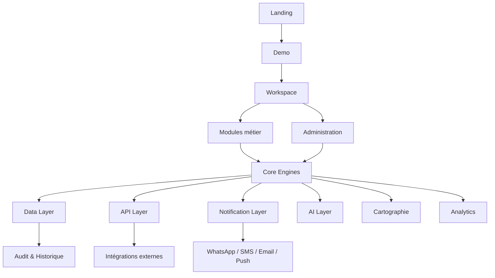
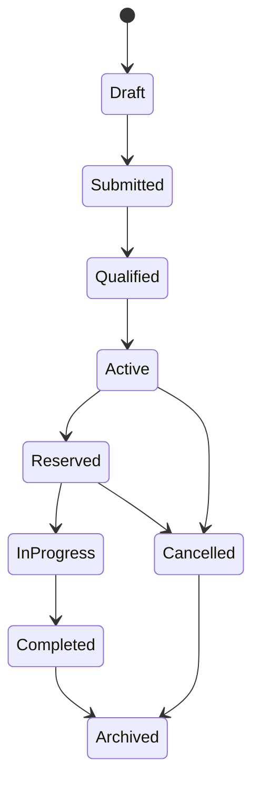
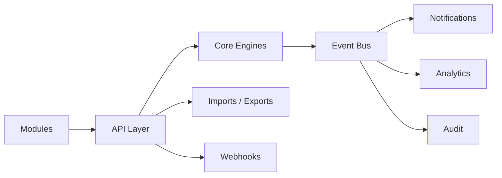

# Mbàmbulaan Engineering Blueprint v1.0

## Statut du document

Ce document est le référentiel technique officiel de Mbàmbulaan. Il décrit comment l'architecture doit vivre, évoluer et rester cohérente avec la vision produit.

Il ne décrit pas comment coder les écrans ou les composants. Il définit les principes, domaines, objets, flux, permissions, couches techniques, exigences non fonctionnelles et décisions d'architecture nécessaires pour piloter plusieurs équipes sans perte de cohérence.

## 1. Vision Engineering

Mbàmbulaan doit être construit comme une plateforme de coordination territoriale, pas comme une collection de pages. L'architecture doit permettre de relier terrain, acteurs, données, décisions, notifications, cartes, tableaux de bord, IA et intégrations.

| Principe | Description | Implication |
| --- | --- | --- |
| Platform First | Le produit est une plateforme avant d'être une interface | Les modules consomment des capacités communes |
| API First | Les capacités doivent pouvoir être exposées proprement | Les intégrations futures ne doivent pas exiger de réécriture |
| Mobile First | Les usages terrain doivent rester prioritaires | Les workflows critiques fonctionnent sur mobile |
| Offline First | Le terrain peut être faiblement connecté | Brouillons, synchronisation et résolution de conflits sont prévus |
| Event Driven | Les changements métier produisent des événements | Notifications, audit, analytics et IA s'appuient sur ces événements |
| Security by Design | La sécurité est native | Droits, traçabilité, chiffrement et audit dès le départ |
| Scalable | La plateforme doit passer de pilotes à multi-territoires | Découplage, pagination, cache, files et observabilité |
| Composable | Les modules doivent s'assembler sans dépendances fortes | Engines, API et data layer sont séparés |
| Human-in-the-loop | Les décisions critiques restent explicables et validables | IA assistive, validation humaine et audit |

## 2. Architecture globale

| Couche | Responsabilité |
| --- | --- |
| Landing | Acquisition, preuve publique, demande de démo |
| Workspace | Expérience connectée contextualisée par rôle |
| Modules | Arrivages, besoins, opportunités, transactions, cartes, dashboard |
| Core Engines | Identité, territoire, fisheries, coordination, décision, workflow |
| Data Layer | Objets métier, événements, historiques, référentiels |
| API Layer | REST, GraphQL futur, webhooks, imports, exports |
| Notification Layer | Routage des messages et alertes |
| AI Layer | Recommandation, matching, anomalies, synthèse |
| Cartographie | Zones, quais, flux, alertes territoriales |
| Administration | Droits, référentiels, audit, configuration |
| Analytics | KPI, observatoire, impact, performance |

## 3. Architecture des données

| Modèle | Rôle | Données clés |
| --- | --- | --- |
| Person | Individu utilisateur ou acteur | identité, contacts, rôles, statut vérification |
| Organisation | Coopérative, entreprise, institution | nom, type, territoire, membres, droits |
| Village | Unité locale de rattachement | nom, zone, coordonnées, référents |
| Zone de pêche | Espace halieutique | nom, limites, espèces, risques |
| Débarquement | Événement terrain | quai, heure, acteur, volumes, source |
| Lot | Unité suivie | identifiant, espèce, quantité, qualité, statut |
| Capture | Information de pêche | espèce, méthode, zone, période |
| Produit | Objet commercialisable | espèce, forme, unité, qualité |
| Prix | Signal économique | produit, marché, période, valeur, source |
| Marché | Lieu ou canal de demande | nom, zone, acteurs, prix |
| Projet | Initiative opérationnelle | objectifs, territoire, acteurs, jalons |
| Programme | Cadre institutionnel ou ONG | financeur, zones, KPI, bénéficiaires |
| Subvention | Aide ou financement | montant, bénéficiaire, statut, conditions |
| Opportunité | Mise en relation proposée | lot, besoin, score, statut, acteurs |
| Alerte | Signal actionnable | type, niveau, zone, priorité, statut |
| Notification | Message ciblé | destinataire, canal, contenu, lu/traité |
| Conversation | Échange encadré | participants, contexte, messages, statut |
| Décision | Choix ou recommandation | contexte, options, justification, statut |
| Indicateur | KPI ou métrique | formule, période, périmètre, certitude |
| Document | Pièce ou rapport | type, propriétaire, droits, version |
| Média | Photo, vidéo, audio | source, contexte, droits, métadonnées |
| Audit | Trace de contrôle | acteur, action, ressource, date |
| Historique | Ligne de vie métier | événements, statuts, transitions |

## 4. Relations, cardinalités et cycle de vie

| Relation | Cardinalité | Règle |
| --- | --- | --- |
| Organisation -> Person | 1 à N | Une personne peut appartenir à plusieurs organisations avec rôles distincts |
| Zone -> Village | 1 à N | Un village appartient à une zone principale |
| Zone -> Débarquement | 1 à N | Chaque débarquement est rattaché à une zone ou un quai |
| Débarquement -> Lot | 1 à N | Un débarquement peut produire plusieurs lots |
| Lot -> Opportunité | 1 à N | Un lot peut générer plusieurs opportunités |
| Opportunité -> Transaction | 0 à 1 | Une opportunité réservée produit au plus une transaction active |
| Programme -> Projet | 1 à N | Un programme regroupe plusieurs projets |
| Projet -> Subvention | 0 à N | Une initiative peut recevoir plusieurs financements |
| Alerte -> Notification | 1 à N | Une alerte peut cibler plusieurs destinataires |
| Objet métier -> Audit | 1 à N | Toute action sensible génère une trace |

### Cycle de vie

### Versioning

| Objet | Versioning requis | Raison |
| --- | --- | --- |
| Référentiels | Oui | Historique des règles et valeurs |
| Permissions | Oui | Audit sécurité |
| Documents | Oui | Preuve et conformité |
| Décisions | Oui | Explicabilité |
| Modèles IA | Oui | Reproductibilité des recommandations |
| Indicateurs | Oui | Suivi des formules |

## 5. Permissions

Mbàmbulaan combine RBAC, ABAC et accès contextuel.

| Modèle | Rôle |
| --- | --- |
| RBAC | Donne des permissions de base par rôle : pêcheur, mareyeur, collectivité, admin |
| ABAC | Raffine par attribut : territoire, organisation, statut vérifié, programme |
| Contextual Access | Ouvre une donnée lorsqu'une relation métier existe : opportunité, transaction, programme |

| Dimension | Règle |
| --- | --- |
| Organisation | Les données organisationnelles restent dans le périmètre membre ou mandat |
| Territoire | Les collectivités voient leur zone et les agrégats autorisés |
| Projet | Les partenaires voient seulement les programmes où ils sont parties |
| Données sensibles | Nominatif, transaction et confiance exigent droit explicite |
| Administration | Les accès admin sont journalisés et justifiés |

## 6. Authentification

| Méthode | Usage | Priorité |
| --- | --- | --- |
| Compte classique | Utilisateurs réguliers | MVP |
| OTP | Connexion simple terrain | MVP |
| WhatsApp | Invitation, notification, authentification légère future | V1.5 |
| Email | Institutions, entreprises, administration | MVP |
| Google | Utilisateurs professionnels | V1 |
| SSO futur | Ministères, grandes institutions, enterprise | V2 |

## 7. Architecture API

| Interface | Rôle | Règle |
| --- | --- | --- |
| REST | API opérationnelle simple | Ressources stables, droits stricts |
| GraphQL | Lecture flexible future | Seulement si complexité justifiée |
| Webhooks | Événements sortants | Retry, signature, journalisation |
| Event Bus | Propagation interne | Source pour notifications, audit, analytics |
| Import | Excel, partenaires, back-office | Prévisualisation et validation avant commit |
| Export | Reporting, institutions, BI | Agrégation, anonymisation, droits |
| Synchronisation | Offline et partenaires | Conflits détectés, statuts explicites |

## 8. Architecture IA

L'IA doit rester assistive, explicable et contrôlée. Les règles métier simples restent préférées tant qu'elles suffisent.

| Moteur IA | Mission | Sorties | Garde-fous |
| --- | --- | --- | --- |
| Recommandation | Proposer meilleures actions ou opportunités | Score, raisons, priorité | Explication obligatoire |
| Matching | Relier offre et demande | Opportunités | Critères visibles |
| Prédiction | Anticiper tensions et risques | Prévisions | Marquer comme prédiction |
| Détection anomalies | Repérer données incohérentes | Alertes qualité | Validation humaine |
| Synthèse | Résumer un territoire ou programme | Résumé exécutif | Sources affichées |
| Assistant IA | Aider utilisateur à comprendre | Réponses guidées | Pas de décision automatique sensible |
| Copilote décision | Proposer arbitrages | Options, risques, impacts | Human-in-the-loop |
| Recherche intelligente | Trouver données ou documents | Résultats contextualisés | Respect strict des droits |

## 9. Architecture Cartographie

| Élément | Description |
| --- | --- |
| SIG | Couche géographique structurante |
| Couches | Quais, zones, villages, alertes, flux, programmes |
| Zones | Découpage métier et administratif |
| Ports / Quais | Points opérationnels |
| Villages | Unités locales |
| Débarquements | Événements géolocalisés |
| Flux | Relations lots, besoins, transactions |
| Alertes | Risques territoriaux |
| Heatmaps | Densité, tension, activité |

## 10. Architecture Messaging

| Canal | Usage |
| --- | --- |
| WhatsApp | Terrain, invitations, alertes simples, relances |
| SMS | Fallback faible connectivité |
| Email | Institutions, rapports, administration |
| Push | App future, alertes opérationnelles |
| Notifications | Centre interne, priorités, statuts |
| Files | Documents, preuves, médias |
| Historique | Conversations et actions liées au contexte métier |

## 11. Architecture Offline

| Capacité | Règle |
| --- | --- |
| Synchronisation | Toute donnée offline a un statut : brouillon, en attente, synchronisée, conflit |
| Cache | Cache par rôle et territoire, jamais global sensible |
| Conflits | Résolution explicite avec version, source et horodatage |
| Mode déconnecté | Actions terrain essentielles seulement |
| Réconciliation | Les données critiques peuvent demander validation humaine |

## 12. Architecture Administration

| Domaine | Responsabilité |
| --- | --- |
| Paramétrage | Règles métier, seuils, canaux, territoires |
| Référentiels | Espèces, quais, statuts, rôles, zones |
| Utilisateurs | Invitations, rôles, vérifications, suspensions |
| Logs | Activités sensibles et erreurs fonctionnelles |
| Audit | Qui a fait quoi, quand, pourquoi |
| Configuration | Paramètres organisations, programmes, intégrations |

## 13. Architecture Observabilité

| Objet | Usage |
| --- | --- |
| Logs | Comprendre erreurs, actions sensibles, imports |
| Metrics | Santé système, usage, latence, volume |
| Tracing | Suivre un flux complexe de bout en bout |
| Monitoring | Disponibilité et performance |
| Alertes | Détecter incidents techniques et métier |
| Incidents | Qualification, résolution, post-mortem |

## 14. Architecture Sécurité

| Sujet | Exigence |
| --- | --- |
| OWASP | Les risques web courants doivent être traités dès conception |
| Secrets | Jamais exposés, rotation prévue |
| RGPD | Minimisation, consentement, droits, conservation |
| Chiffrement | Données sensibles au repos et en transit |
| Permissions | Vérification côté serveur, pas seulement interface |
| Audit | Toute action sensible tracée |
| Traçabilité | Les modifications critiques sont historisées |

## 15. Architecture Performance

| Sujet | Règle |
| --- | --- |
| Scalabilité | Séparer lecture, écriture, événements et analytics |
| Cache | Cacher données publiques ou autorisées par périmètre |
| CDN | Servir assets publics et médias non sensibles |
| Compression | Réduire payloads et médias |
| Pagination | Obligatoire sur listes longues |
| Indexation | Prévoir index par territoire, acteur, statut, période |

## 16. Architecture Déploiement

| Environnement | Rôle |
| --- | --- |
| Dev | Expérimentation et développement |
| Test | Validation automatisée et intégration |
| Préprod | Validation métier et UX proche production |
| Production | Usage réel, monitoring, sécurité |
| CI/CD | Build, tests, checks, déploiement contrôlé |
| Rollback | Retour arrière rapide et documenté |

## 17. Architecture Tests

| Type | Cible |
| --- | --- |
| Unitaires | Règles métier, calculs, permissions |
| Intégration | API, engines, data layer, événements |
| End-to-End | Parcours critiques acteur |
| UX | Clarté, action principale, mobile, états |
| Performance | Listes, dashboard, carte, imports |
| Sécurité | Permissions, injection, accès, audit |

## 18. Architecture Evolutive

| Extension future | Préparation |
| --- | --- |
| IoT | Modèle événementiel et qualité lot |
| Satellites | Couches cartographiques et enrichissement territorial |
| AIS | Flux logistiques et maritime future |
| Paiement mobile | Marketplace découplée des transactions financières |
| Blockchain si pertinent | Uniquement pour preuve ou certification, pas par défaut |
| Nouveaux pays | Référentiels et territoires configurables |
| Nouveaux métiers | Rôles, permissions et modules composables |

## 19. Décisions techniques

### Décisions prises

| Décision | Statut |
| --- | --- |
| Séparer moteurs métier et interfaces | Pris |
| Construire autour d'objets métier et événements | Pris |
| Appliquer RBAC + ABAC + accès contextuel | Pris |
| Garder l'IA explicable et human-in-the-loop | Pris |
| Prévoir API, imports, exports et webhooks | Pris |
| Prioriser mobile, offline et WhatsApp pour terrain | Pris |
| Journaliser actions sensibles | Pris |

### Décisions ouvertes

| Décision | Question |
| --- | --- |
| Choix exact backend | Framework et runtime à arbitrer |
| Base de données principale | Relationnelle, document ou hybride |
| Moteur cartographique | SIG et rendu à arbitrer |
| Fournisseur messaging | WhatsApp, SMS, email à sélectionner |
| Fournisseur auth | Build vs service managé |
| Stratégie data warehouse | Moment et architecture à définir |
| Infrastructure cloud | Région, souveraineté, coût |

## 20. Engineering Principles

### Obligatoire

| Principe | Règle |
| --- | --- |
| Domain first | Les objets métier guident l'architecture |
| Server-side permissions | Toute donnée sensible vérifiée côté serveur |
| Event log | Les changements importants produisent un événement |
| Explainability | Score, alerte et recommandation doivent être expliqués |
| Observability | Toute feature critique doit être observable |
| Documentation | Toute capacité exposée doit être documentée |
| Testability | Les règles métier doivent être testables isolément |
| Data ownership | Chaque donnée a un propriétaire |

### Interdit

| Interdit | Raison |
| --- | --- |
| Logique métier cachée dans l'interface | Casse la cohérence multi-canaux |
| Permissions uniquement visuelles | Risque sécurité critique |
| Données dupliquées sans source de vérité | Incohérence |
| IA opaque sur décision sensible | Perte de confiance |
| Exports sans contrôle des droits | Risque juridique |
| API couplée à un écran | Bloque les intégrations |
| Logs contenant secrets ou données sensibles inutiles | Risque sécurité |
